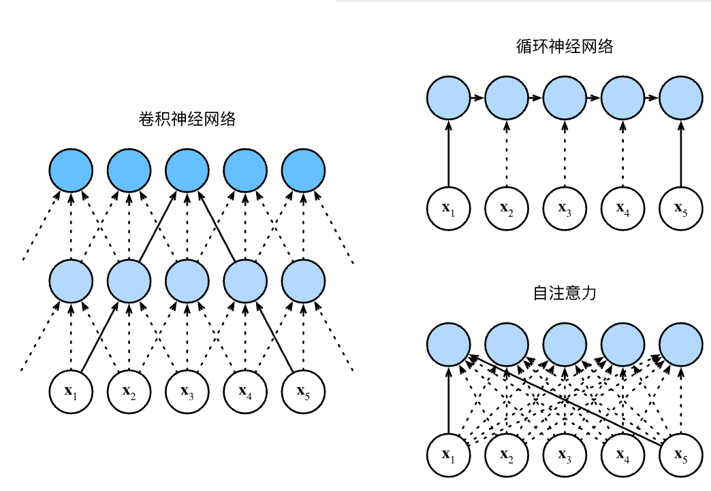

# 自注意力和位置编码

## **自注意力

给定一个由词元组成的输入序列 $\mathbf{x}_1, \ldots, \mathbf{x}_n$，
其中任意 $\mathbf{x}_i \in \mathbb{R}^d$（$1 \leq i \leq n$）。
该序列的自注意力输出为一个长度相同的序列
$\mathbf{y}_1, \ldots, \mathbf{y}_n$，其中：

$$
\mathbf{y}_i = f(\mathbf{x}_i, (\mathbf{x}_1, \mathbf{x}_1), \ldots, (\mathbf{x}_n, \mathbf{x}_n)) \in \mathbb{R}^d
$$

## 比较卷积神经网络、循环神经网络和自注意力

|      结构      |      计算复杂性      |     顺序操作     |    最大路径长度    |
| :------------: | :------------------: | :--------------: | :----------------: |
|      CNN       | $\mathcal{O}(knd^2)$ | $\mathcal{O}(1)$ | $\mathcal{O}(n/k)$ |
|      RNN       |  $\mathcal{O}(d^2)$  | $\mathcal{O}(n)$ |  $\mathcal{O}(n)$  |
| self-attention | $\mathcal{O}(n^2d)$  | $\mathcal{O}(1)$ |  $\mathcal{O}(1)$  |

卷积神经网络和自注意力都拥有并行计算的优势，
而且自注意力的最大路径长度最短。
但是因为其计算复杂度是关于序列长度的二次方，所以在很长的序列中计算会非常慢。

## 位置编码


在处理词元序列时，循环神经网络是逐个的重复地处理词元的，
而自注意力则因为并行计算而放弃了顺序操作。
为了使用序列的顺序信息，通过在输入表示中添加
*位置编码*（positional encoding）来注入绝对的或相对的位置信息。
位置编码可以通过学习得到也可以直接固定得到。

假设输入表示 $\mathbf{X} \in \mathbb{R}^{n \times d}$
包含一个序列中 $n$ 个词元的 $d$ 维嵌入表示。
位置编码使用相同形状的位置嵌入矩阵

$\mathbf{P} \in \mathbb{R}^{n \times d}$
输出 $\mathbf{X} + \mathbf{P}$，
矩阵第$i$行、第$2j$列和$2j+1$列上的元素为：

$$
\begin{aligned} p_{i, 2j} &= \sin\left(\frac{i}{10000^{2j/d}}\right),\\p_{i, 2j+1} &= \cos\left(\frac{i}{10000^{2j/d}}\right).\end{aligned}
$$


## 小结

* 在自注意力中，查询、键和值都来自同一组输入。
* 卷积神经网络和自注意力都拥有并行计算的优势，而且自注意力的最大路径长度最短。但是因为其计算复杂度是关于序列长度的二次方，所以在很长的序列中计算会非常慢。
* 为了使用序列的顺序信息，可以通过在输入表示中添加位置编码，来注入绝对的或相对的位置信息。

