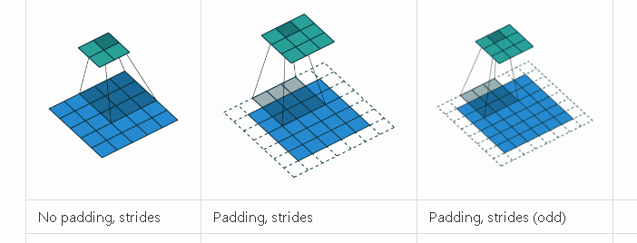
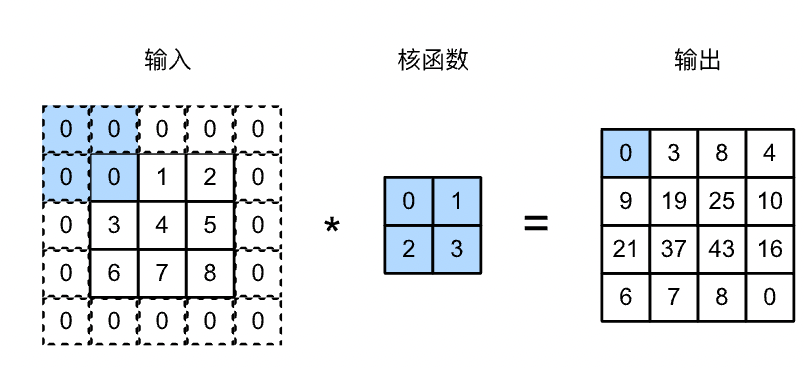

# 填充和步幅



## 填充
填充即是在输入图像的边界填充元素（通常填充元素是 $0$ ）


卷积神经网络中卷积核的高度和宽度通常为奇数，例如1、3、5或7。
选择奇数的好处是，保持空间维度的同时，我们可以在顶部和底部填充相同数量的行，在左侧和右侧填充相同数量的列。

此外，使用奇数的核大小和填充大小也提供了书写上的便利。对于任何二维张量`X`，当满足：
1. 卷积核的大小是奇数；
2. 所有边的填充行数和列数相同；
3. 输出与输入具有相同高度和宽度
则可以得出：输出`Y[i, j]`是通过以输入`X[i, j]`为中心，与卷积核进行互相关计算得到的。

## 步幅
步幅即是卷积核一次移动的距离，默认是平移一个像素

```python
conv2d = nn.Conv2d(1, 1, kernel_size=3, padding=1, stride=2)
conv2d = nn.Conv2d(1, 1, kernel_size=(3, 5), padding=(0, 1), stride=(3, 4))
```
以上两行代码分别制定了填充和步幅，注意可以使用元祖制定不同方向的数值


## 小结

* 填充可以增加输出的高度和宽度。这常用来使输出与输入具有相同的高和宽。
* 步幅可以减小输出的高和宽，例如输出的高和宽仅为输入的高和宽的$1/n$（$n$是一个大于$1$的整数）。
* 填充和步幅可用于有效地调整数据的维度。
