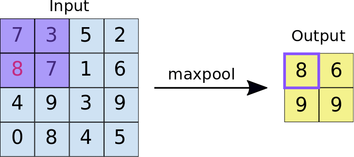

# 汇聚/池化层

## 池化的意义
- 降低卷积层对位置的敏感性
- 同时降低对空间降采样表示的敏感性。
## 最大池化和平均池化

与卷积层类似，通过滑动窗口，选择最大值为最大池化，计算平均值为平均池化
### 填充和步幅
pooling 层也可设置padding和strides，与卷积层并无差异
> - [填充和步幅](../padding-and-strides)
### 多通道
与卷积层不同的是，池化层是对每个通道进行分别计算，并不会汇聚不同通道的信息，所以池化层的输出通道数一定与输入相同

## 小结

* 对于给定输入元素，最大汇聚层会输出该窗口内的最大值，平均汇聚层会输出该窗口内的平均值。
* 汇聚层的主要优点之一是减轻卷积层对位置的过度敏感。
* 我们可以指定汇聚层的填充和步幅。
* 使用最大汇聚层以及大于1的步幅，可减少空间维度（如高度和宽度）。
* 汇聚层的输出通道数与输入通道数相同。

