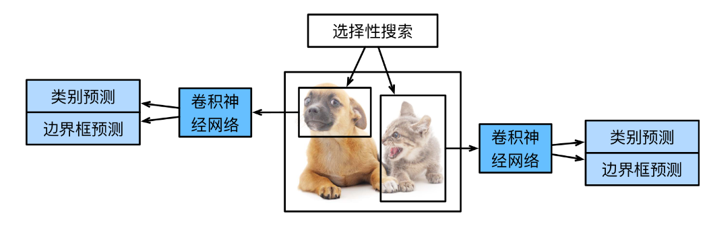
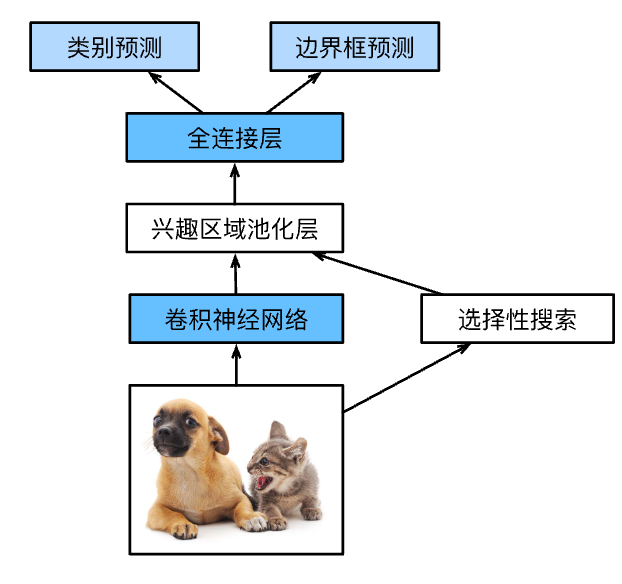

# 区域卷积神经网络（R-CNN）

## R-CNN
*R-CNN*首先从输入图像中选取若干（例如2000个）*提议区域*（如锚框也是一种选取方法），并标注它们的类别和边界框（如偏移量）。 然后，用卷积神经网络对每个提议区域进行前向传播以抽取其特征。

接下来，用每个提议区域的特征来预测类别和边界框。

具体来说，R-CNN包括以下四个步骤：

1. 对输入图像使用*选择性搜索*来选取多个高质量的提议区域。这些提议区域通常是在多个尺度下选取的，并具有不同的形状和大小。每个提议区域都将被标注类别和真实边界框；
1. 选择一个预训练的卷积神经网络，并将其在输出层之前截断。将每个提议区域变形为网络需要的输入尺寸，并通过前向传播输出抽取的提议区域特征；
1. 将每个提议区域的特征连同其标注的类别作为一个样本。训练多个支持向量机对目标分类，其中每个支持向量机用来判断样本是否属于某一个类别；
1. 将每个提议区域的特征连同其标注的边界框作为一个样本，训练线性回归模型来预测真实边界框。

尽管R-CNN模型通过预训练的卷积神经网络有效地抽取了图像特征，但它的速度很慢。
想象一下，我们可能从一张图像中选出上千个提议区域，这需要上千次的卷积神经网络的前向传播来执行目标检测。
这种庞大的计算量使得R-CNN在现实世界中难以被广泛应用。
## Fast R-CNN

R-CNN的主要性能瓶颈在于，对每个提议区域，卷积神经网络的前向传播是独立的，而没有共享计算。
由于这些区域通常有重叠，独立的特征抽取会导致重复的计算。
*Fast R-CNN*对R-CNN的主要改进之一，是仅在整张图象上执行卷积神经网络的前向传播。

它的主要计算如下：

1. 与R-CNN相比，Fast R-CNN用来提取特征的卷积神经网络的输入是整个图像，而不是各个提议区域。此外，这个网络通常会参与训练。设输入为一张图像，将卷积神经网络的输出的形状记为$1 \times c \times h_1  \times w_1$；
1. 假设选择性搜索生成了$n$个提议区域。这些形状各异的提议区域在卷积神经网络的输出上分别标出了形状各异的兴趣区域。然后，这些感兴趣的区域需要进一步抽取出形状相同的特征（比如指定高度$h_2$和宽度$w_2$），以便于连结后输出。为了实现这一目标，Fast R-CNN引入了*兴趣区域汇聚层*（RoI pooling）：将卷积神经网络的输出和提议区域作为输入，输出连结后的各个提议区域抽取的特征，形状为$n \times c \times h_2 \times w_2$；
1. 通过全连接层将输出形状变换为$n \times d$，其中超参数$d$取决于模型设计；
1. 预测$n$个提议区域中每个区域的类别和边界框。更具体地说，在预测类别和边界框时，将全连接层的输出分别转换为形状为$n \times q$（$q$是类别的数量）的输出和形状为$n \times 4$的输出。其中预测类别时使用softmax回归。

## 小结

* R-CNN对图像选取若干提议区域，使用卷积神经网络对每个提议区域执行前向传播以抽取其特征，然后再用这些特征来预测提议区域的类别和边界框。
* Fast R-CNN对R-CNN的一个主要改进：只对整个图像做卷积神经网络的前向传播。它还引入了兴趣区域汇聚层，从而为具有不同形状的兴趣区域抽取相同形状的特征。
* Faster R-CNN将Fast R-CNN中使用的选择性搜索替换为参与训练的区域提议网络，这样后者可以在减少提议区域数量的情况下仍保证目标检测的精度。
* Mask R-CNN在Faster R-CNN的基础上引入了一个全卷积网络，从而借助目标的像素级位置进一步提升目标检测的精度。

