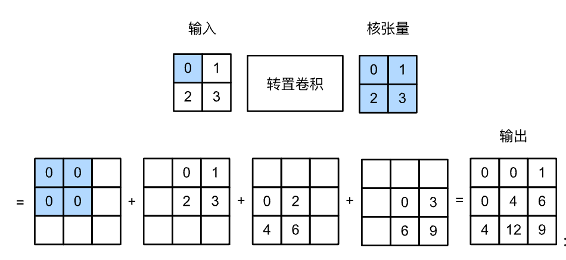
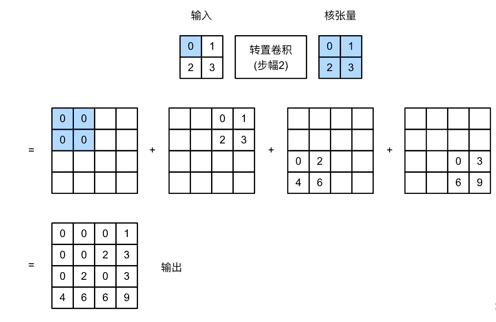

# 转置卷积


到目前为止，我们所见到的卷积神经网络层，例如卷积）和汇聚层，通常会减少下采样输入图像的空间维度（高和宽）。
然而如果输入和输出图像的空间维度相同，在以像素级分类的语义分割中将会很方便。
例如，输出像素所处的通道维可以保有输入像素在同一位置上的分类结果。

为了实现这一点，尤其是在空间维度被卷积神经网络层缩小后，我们可以使用另一种类型的卷积神经网络层，它可以增加上采样中间层特征图的空间维度。
本节将介绍
*转置卷积*（transposed convolution） 
用于逆转下采样导致的空间尺寸减小。

## 基本操作

让我们暂时忽略通道，从基本的转置卷积开始，设步幅为1且没有填充。
假设我们有一个$n_h \times n_w$的输入张量和一个$k_h \times k_w$的卷积核。
以步幅为1滑动卷积核窗口，每行$n_w$次，每列$n_h$次，共产生$n_h n_w$个中间结果。
每个中间结果都是一个$(n_h + k_h - 1) \times (n_w + k_w - 1)$的张量，初始化为0。
为了计算每个中间张量，输入张量中的每个元素都要乘以卷积核，从而使所得的$k_h \times k_w$张量替换中间张量的一部分。
请注意，每个中间张量被替换部分的位置与输入张量中元素的位置相对应。
最后，所有中间结果相加以获得最终结果。



```python
def trans_conv(X, K):
    h, w = K.shape
    Y = torch.zeros((X.shape[0] + h - 1, X.shape[1] + w - 1))
    for i in range(X.shape[0]):
        for j in range(X.shape[1]):
            Y[i: i + h, j: j + w] += X[i, j] * K
    return Y
```


## [**填充、步幅和多通道**]

与常规卷积不同，在转置卷积中，填充被应用于的输出（常规卷积将填充应用于输入）。
例如，当将高和宽两侧的填充数指定为1时，转置卷积的输出中将删除第一和最后的行与列。



## [**与矩阵变换的联系**]

转置卷积为何以矩阵变换命名呢？
让我们首先看看如何使用矩阵乘法来实现卷积。
在下面的示例中，我们定义了一个$3\times 3$的输入`X`和$2\times 2$卷积核`K`，然后使用`corr2d`函数计算卷积输出`Y`。


## 小结

* 与通过卷积核减少输入元素的常规卷积相反，转置卷积通过卷积核广播输入元素，从而产生形状大于输入的输出。
* 如果我们将$\mathsf{X}$输入卷积层$f$来获得输出$\mathsf{Y}=f(\mathsf{X})$并创造一个与$f$有相同的超参数、但输出通道数是$\mathsf{X}$中通道数的转置卷积层$g$，那么$g(Y)$的形状将与$\mathsf{X}$相同。
* 我们可以使用矩阵乘法来实现卷积。转置卷积层能够交换卷积层的正向传播函数和反向传播函数。
