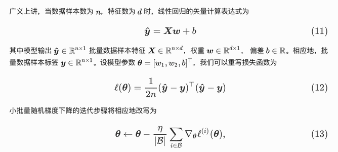
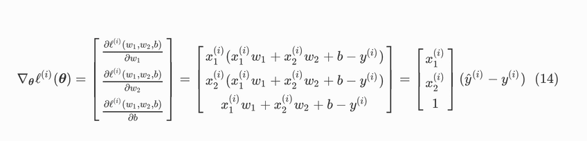

# 线性回归(1)--算法

回归（regression）是能为一个或多个自变量与因变量之间关系建模的一类方法。在自然科学和社会科学领域，回归经常用来表示输入和输出之间的关系。  

在机器学习领域中的大多数任务通常都与预测（prediction）有关。 当我们想预测一个**数值**时，就会涉及到回归问题。 常见的例子包括：预测价格（房屋、股票等）、预测住院时间（针对住院病人等）、 预测需求（零售销量等）。 但不是所有的预测都是回归问题。
<!--more-->

## 线性回归基本元素

> 为了解释*线性回归*，我们举一个实际的例子：
我们希望根据房屋的面积（平方英尺）和房龄（年）来估算房屋价格（美元）。
为了开发一个能预测房价的模型，我们需要收集一个真实的数据集。
这个数据集包括了房屋的销售价格、面积和房龄。
> 
> 在机器学习的术语中，该数据集称为*训练数据集*（training data set）
或*训练集*（training set）。
每行数据（比如一次房屋交易相对应的数据）称为*样本*（sample），
也可以称为*数据点*（data point）或*数据样本*（data instance）。
> 
> 我们把试图预测的目标（比如预测房屋价格）称为*标签*（label）或*目标*（target）。
预测所依据的自变量（面积和房龄）称为*特征*（feature）或*协变量*（covariate）。
> 
> 通常，我们使用$n$来表示数据集中的样本数。
对索引为 $i$ 的样本，其输入表示为 $\mathbf{x}^{(i)} = [x_1^{(i)}, x_2^{(i)}]^\top$ ，
其对应的标签是 $y^{(i)}$ 。

### 线性模型
线性假设是指目标（房屋价格）可以表示为特征（面积和房龄）的加权和，如下面的式子：

$$\mathrm{price} = w_{\mathrm{area}} \cdot \mathrm{area} + w_{\mathrm{age}} \cdot \mathrm{age} + b.$$

而在机器学习领域，我们通常使用的是高维数据集，建模时采用线性代数表示法会比较方便。
当我们的输入包含$d$个特征时，我们将预测结果 $\hat{y}$（通常使用“尖角”符号表示$y$的估计值）表示为：

$$\hat{y} = w_1  x_1 + ... + w_d  x_d + b.$$

将所有特征放到向量 $\mathbf{x} \in \mathbb{R}^d$ 中，
并将所有权重放到向量 $\mathbf{w} \in \mathbb{R}^d$ 中，
我们可以用点积形式来简洁地表达模型：

$$\hat{y} = \mathbf{w}^\top \mathbf{x} + b.$$

向量 $\mathbf{x}$ 对应于单个数据样本的特征。
用符号表示的矩阵 $\mathbf{X} \in \mathbb{R}^{n \times d}$
可以很方便地引用我们整个数据集的 $n$ 个样本。
其中， $\mathbf{X}$ 的每一行是一个样本，每一列是一种特征。

对于特征集合 $\mathbf{X}$ ，预测值 $\hat{\mathbf{y}} \in \mathbb{R}^n$ 
可以通过矩阵-向量乘法表示为：
$${\hat{\mathbf{y}}} = \mathbf{X} \mathbf{w} + b$$

线性回归的目标是找到一组权重向量 $\mathbf{w}$ 和偏置 $b$ ：  
当给定从 $\mathbf{X}$ 的同分布中取样的新样本特征时，  
这组权重向量和偏置能够使得新样本预测标签的误差尽可能小

**在这个实际的例子中，我们的线性模型表达式如下：**

$$\hat{y} = w_1  x_1 + w_2  x_2 + b.$$

在开始寻找最好的*模型参数*（model parameters） $\mathbf{w}$ 和 $b$ 之前，
我们还需要两个东西：  
1. 一种模型质量的度量方式；  
2. 一种能够更新模型以提高模型预测质量的方法。  
### 损失函数

在我们开始考虑如何用模型*拟合*（fit）数据之前，我们需要确定一个拟合程度的度量。  
*损失函数*（loss function）能够量化目标的*实际*值与*预测*值之间的差距。  
通常我们会选择非负数作为损失，且数值越小表示损失越小，完美预测时的损失为0。  
回归问题中最常用的损失函数是平方误差函数。  
当样本 $i$ 的预测值为 $\hat{y}^{(i)}$ ，其相应的真实标签为 $y^{(i)}$ 时，
平方误差可以定义为以下公式：

$$l^{(i)}(\mathbf{w}, b) = \frac{1}{2} \left(\hat{y}^{(i)} - y^{(i)}\right)^2.$$

常数 $\frac{1}{2}$ 不会带来本质的差别，但这样在形式上稍微简单一些（因为当我们对损失函数求导后常数系数为1）。
由于训练数据集并不受我们控制，所以经验误差只是关于模型参数的函数。

图中的直线就是我们的模型，线上的值为预测值，蓝色的点为实际值。

由于平方误差函数中的二次方项，
估计值 $\hat{y}^{(i)}$ 和观测值 $y^{(i)}$ 之间较大的差异将导致更大的损失。
为了度量模型在整个数据集上的质量，我们需计算在训练集 $n$ 个样本上的损失均值（也等价于求和）。

$$ L(\mathbf{w}, b) =\frac{1}{n}\sum_{i=1}^n l^{(i)}(\mathbf{w}, b) =\frac{1}{n} \sum_{i=1}^n \frac{1}{2}\left(\mathbf{w}^\top \mathbf{x}^{(i)} + b - y^{(i)}\right)^2. $$ 



在训练模型时，我们希望寻找一组参数 $\mathbf{w}^\*, b^\*$ ，
这组参数能最小化在**所有训练样本上的总损失**。如下式：
$$\mathbf{w}^\*, b^\* = \operatorname\*{argmin}_{\mathbf{w}, b}\  L(\mathbf{w}, b).$$


### 优化方法

#### 解析解

线性回归的解可以用一个公式简单地表达出来，
这类解叫作解析解（analytical solution）。
首先，我们将偏置 $b$ 合并到参数 $\mathbf{w}$ 中，合并方法是在包含所有参数的矩阵中附加一列。
我们的预测问题是最小化 $\|\mathbf{y} - \mathbf{X}\mathbf{w}\|^2$ 。
这在损失平面上只有一个临界点，这个临界点对应于整个区域的损失极小点。
将损失关于 $\mathbf{w}$ 的导数设为0，得到解析解：
$$\mathbf{w}^* = (\mathbf X^\top \mathbf X)^{-1}\mathbf X^\top \mathbf{y}.$$

像线性回归这样的简单问题存在解析解，但并不是所有的问题都存在解析解。
解析解可以进行很好的数学分析，但解析解对问题的限制很严格，导致它无法广泛应用在深度学习里。

#### 数值解（小批量随机梯度下降）

在每次迭代中，我们首先随机抽样一个小批量$\mathcal{B}$，
它是由固定数量的训练样本组成的。
然后，我们计算小批量的平均损失关于模型参数的导数（也可以称为梯度）。
最后，我们将梯度乘以一个预先确定的正数$\eta$，并从当前参数的值中减掉。

我们用下面的数学公式来表示这一更新过程（$\partial$表示偏导数）：

$$(\mathbf{w},b) \leftarrow (\mathbf{w},b) - \frac{\eta}{|\mathcal{B}|} \sum_{i \in \mathcal{B}} \partial_{(\mathbf{w},b)} l^{(i)}(\mathbf{w},b).$$

总结一下，算法的步骤如下：
1. 初始化模型参数的值，如随机初始化；
2. 从数据集中随机抽取小批量样本且在负梯度的方向上更新参数，并不断迭代这一步骤。

对于平方损失和仿射变换，我们可以明确地写成如下形式:

$$\begin{aligned} \mathbf{w} &\leftarrow \mathbf{w} -   \frac{\eta}{|\mathcal{B}|} \sum_{i \in \mathcal{B}} \partial_{\mathbf{w}} l^{(i)}(\mathbf{w}, b) = \mathbf{w} - \frac{\eta}{|\mathcal{B}|} \sum_{i \in \mathcal{B}} \mathbf{x}^{(i)} \left(\mathbf{w}^\top \mathbf{x}^{(i)} + b - y^{(i)}\right),\\\
b &\leftarrow b -  \frac{\eta}{|\mathcal{B}|} \sum_{i \in \mathcal{B}} \partial_b l^{(i)}(\mathbf{w}, b)  = b - \frac{\eta}{|\mathcal{B}|} \sum_{i \in \mathcal{B}} \left(\mathbf{w}^\top \mathbf{x}^{(i)} + b - y^{(i)}\right). \end{aligned}$$

 $|\mathcal{B}|$ 表示每个小批量中的样本数，这也称为*批量大小*（batch size）。  
 $\eta$ 表示*学习率*（learning rate）。  
批量大小和学习率的值通常是手动预先指定，而不是通过模型训练得到的。
这些可以调整但不在训练过程中更新的参数称为*超参数*（hyperparameter）。
*调参*（hyperparameter tuning）是选择超参数的过程。
超参数通常是我们根据训练迭代结果来调整的，
而训练迭代结果是在独立的*验证数据集*（validation dataset）上评估得到的。

## 线性回归的表示⽅法

### 神经网络

根据线性回归的形式，很容易看出来它就是一个单层的神经网络：


### 矢量计算

使用向pytorch的向量运算效率很高，因此，应该尽量将计算表示成向量运算的形式：

其中梯度可表示为：

