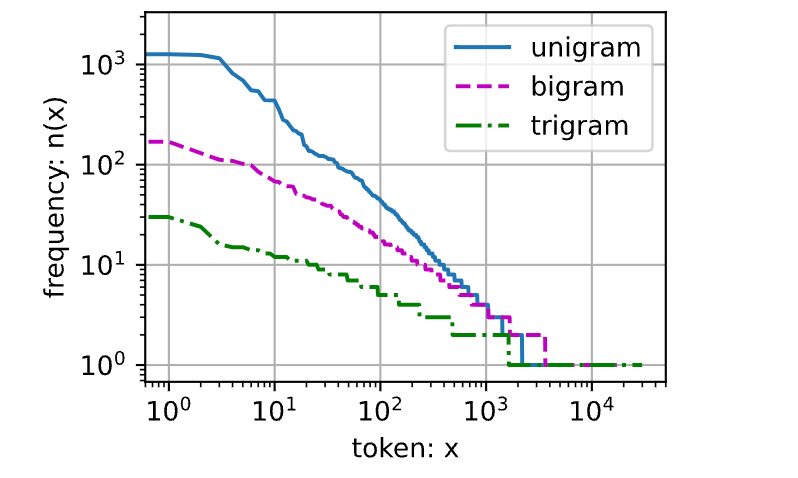
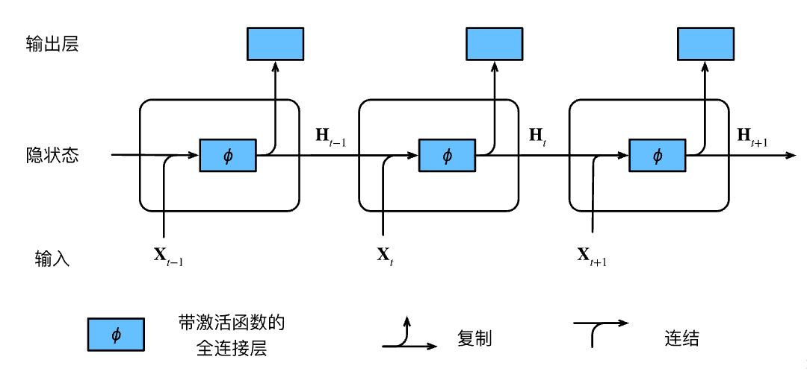
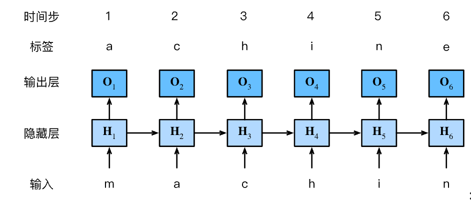

# 循环神经网络


## 自回归模型
首先它是回归模型，它的“自”指的是对自己进行回归，具体来说，要预测 $x_t$ 的值，需要用到的也是x的信息: $\[x_{t-1},\dots,x_{t-\tau}\]$

还有一种策略是*隐变量自回归*，直接感性的理解：将之前的信息类似特征工程，抽取成新的变量即为隐变量，利用隐变量和 $\[x_{t-1},\dots,x_{t-\tau}\]$ 预测  $x_t$ 。

## 马尔可夫模型

上述的使用有限的信息  $\[x_{t-1},\dots,x_{t-\tau}\]$ 来预测满足*马尔可夫条件*，特别是，如果 $\tau = 1$，得到一个*一阶马尔可夫模型*（first-order Markov model），

这里处理数据的方法值得学习，将一定长度的x作为features的一列，tau就是features的列数：
```python
tau = 4
features = torch.zeros((T - tau, tau))
for i in range(tau):
    features[:, i] = x[i: T - tau + i]
labels = x[tau:].reshape((-1, 1))
```
如上代码构建了一组训练数据，以$x_t$为标签 以$\[x_{t-1},...,x_{t-4}\]$ 为特征 ，其中t从4到999
## 文本预处理

文本预处理步骤通常包括：

1. 将文本作为字符串加载到内存中。
1. 将字符串拆分为词元（如单词和字符）。
1. 建立一个词表，将拆分的词元映射到数字索引。
1. 将文本转换为数字索引序列，方便模型操作。

### 词元化
即tokenize,将文本分割成一个个小单元，可以是一句话、一个单词甚至一个字符
```python
def tokenize(lines, token='word'):  #@save
    """将文本行拆分为单词或字符词元"""
    if token == 'word':
        return [line.split() for line in lines]
    elif token == 'char':
        return [list(line) for line in lines]
    else:
        print('错误：未知词元类型：' + token)
```
### 词表
即 vocabulary,将词元进行统计和排序，得到的统计结果称之为*语料*（corpus）。
然后根据每个唯一词元的出现频率，为其分配一个数字索引。很少出现的词元通常被移除，这可以降低复杂性。另外，语料库中不存在或已删除的任何词元都将映射到一个特定的未知词元“&lt;unk&gt;”。例如：填充词元（“&lt;pad&gt;”）；
序列开始词元（“&lt;bos&gt;”）；
序列结束词元（“&lt;eos&gt;”）。

构建词表将词元字符串映射为数字索引，并将文本数据转换为词元索引以供模型操作。

## 学习语言模型

语言模型本质上就是对一个文档甚至一个词元序列进行建模

$$P(x_1, x_2, \ldots, x_T) = \prod_{t=1}^T P(x_t  \mid  x_1, \ldots, x_{t-1}).$$

例如，包含了四个单词的一个文本序列的概率是：

$$P(\text{deep}, \text{learning}, \text{is}, \text{fun}) =  P(\text{deep}) P(\text{learning}  \mid  \text{deep}) P(\text{is}  \mid  \text{deep}, \text{learning}) P(\text{fun}  \mid  \text{deep}, \text{learning}, \text{is}).$$


为了训练语言模型，我们需要计算单词的概率，
以及给定前面几个单词后出现某个单词的条件概率。
这些概率本质上就是语言模型的参数。

估计 deep后面是learning可以用下面的公式：
$$\hat{P}(\text{learning} \mid \text{deep}) = \frac{n(\text{deep, learning})}{n(\text{deep})},$$

## 拉普拉斯平滑法

用$n$表示训练集中的单词总数，用$m$表示唯一单词的数量。
此解决方案有助于处理单元素问题，例如通过：

$$
\begin{aligned}
    \hat{P}(x) & = \frac{n(x) + \epsilon_1/m}{n + \epsilon_1}, \\\
    \hat{P}(x' \mid x) & = \frac{n(x, x') + \epsilon_2 \hat{P}(x')}{n(x) + \epsilon_2}, \\\
    \hat{P}(x'' \mid x,x') & = \frac{n(x, x',x'') + \epsilon_3 \hat{P}(x'')}{n(x, x') + \epsilon_3}.
\end{aligned}
$$

其中，$\epsilon_1,\epsilon_2$和$\epsilon_3$是超参数。
以$\epsilon_1$为例：当$\epsilon_1 = 0$时，不应用平滑；
当$\epsilon_1$接近正无穷大时，$\hat{P}(x)$接近均匀概率分布$1/m$。


## 马尔可夫模型与$n$元语法
如果序列满足马尔可夫性质，则可以用以下公式进行建模

$$
\begin{aligned}
P(x_1, x_2, x_3, x_4) &=  P(x_1) P(x_2) P(x_3) P(x_4),\\\
P(x_1, x_2, x_3, x_4) &=  P(x_1) P(x_2  \mid  x_1) P(x_3  \mid  x_2) P(x_4  \mid  x_3),\\\
P(x_1, x_2, x_3, x_4) &=  P(x_1) P(x_2  \mid  x_1) P(x_3  \mid  x_1, x_2) P(x_4  \mid  x_2, x_3).
\end{aligned}
$$

通常，涉及一个、两个和三个变量的概率公式分别被称为
*一元语法*（unigram）、*二元语法*（bigram）和*三元语法*（trigram）模型。



1. 单词序列遵循齐普夫定律，
2. 词表中$n$元组的数量并没有那么大，这说明语言中存在相当多的结构，
这些结构给了我们应用模型的希望；
3. 很多$n$元组很少出现，这使得拉普拉斯平滑非常不适合语言建模。
作为代替，我们将使用基于深度学习的模型。

## 读取长序例数据
### 随机采样
下面代码从序列中提取X和Y，其中，Y就是X每个元素后移一位， 对于语言建模，目标是基于到目前为止我们看到的词元来预测下一个词元， 因此标签是移位了一个词元的原始序列
```python
def seq_data_iter_random(corpus, batch_size, num_steps):  #@save
    """使用随机抽样生成一个小批量子序列"""
    # 从随机偏移量开始对序列进行分区，随机范围包括num_steps-1
    corpus = corpus[random.randint(0, num_steps - 1):]
    # 减去1，是因为我们需要考虑标签
    num_subseqs = (len(corpus) - 1) // num_steps
    # 长度为num_steps的子序列的起始索引
    initial_indices = list(range(0, num_subseqs * num_steps, num_steps))
    # 在随机抽样的迭代过程中，
    # 来自两个相邻的、随机的、小批量中的子序列不一定在原始序列上相邻
    random.shuffle(initial_indices)

    def data(pos):
        # 返回从pos位置开始的长度为num_steps的序列
        return corpus[pos: pos + num_steps]

    num_batches = num_subseqs // batch_size
    for i in range(0, batch_size * num_batches, batch_size):
        # 在这里，initial_indices包含子序列的随机起始索引
        initial_indices_per_batch = initial_indices[i: i + batch_size]
        X = [data(j) for j in initial_indices_per_batch]
        Y = [data(j + 1) for j in initial_indices_per_batch]
        yield torch.tensor(X), torch.tensor(Y)
```

### 顺序分区
保证两个相邻的小批量中的子序列在原始序列上也是相邻的
```python
def seq_data_iter_sequential(corpus, batch_size, num_steps):  #@save
    """使用顺序分区生成一个小批量子序列"""
    # 从随机偏移量开始划分序列
    offset = random.randint(0, num_steps)
    num_tokens = ((len(corpus) - offset - 1) // batch_size) * batch_size
    Xs = torch.tensor(corpus[offset: offset + num_tokens])
    Ys = torch.tensor(corpus[offset + 1: offset + 1 + num_tokens])
    Xs, Ys = Xs.reshape(batch_size, -1), Ys.reshape(batch_size, -1)
    num_batches = Xs.shape[1] // num_steps
    for i in range(0, num_steps * num_batches, num_steps):
        X = Xs[:, i: i + num_steps]
        Y = Ys[:, i: i + num_steps]
        yield X, Y
```
* 语言模型是自然语言处理的关键。
* $n$元语法通过截断相关性，为处理长序列提供了一种实用的模型。
* 长序列存在一个问题：它们很少出现或者从不出现。
* 齐普夫定律支配着单词的分布，这个分布不仅适用于一元语法，还适用于其他$n$元语法。
* 通过拉普拉斯平滑法可以有效地处理结构丰富而频率不足的低频词词组。
* 读取长序列的主要方式是随机采样和顺序分区。在迭代过程中，后者可以保证来自两个相邻的小批量中的子序列在原始序列上也是相邻的。


## 无状态的神经网络

设隐藏层的激活函数为$\phi$，
给定一个小批量样本$\mathbf{X} \in \mathbb{R}^{n \times d}$，
其中批量大小为$n$，输入维度为$d$，
则隐藏层的输出$\mathbf{H} \in \mathbb{R}^{n \times h}$通过下式计算：

$$\mathbf{H} = \phi(\mathbf{X} \mathbf{W}_{xh} + \mathbf{b}_h).$$

接下来，将隐藏变量$\mathbf{H}$用作输出层的输入。
输出层由下式给出：

$$\mathbf{O} = \mathbf{H} \mathbf{W}_{hq} + \mathbf{b}_q,$$

其中，$\mathbf{O} \in \mathbb{R}^{n \times q}$是输出变量，
$\mathbf{W}_{hq} \in \mathbb{R}^{h \times q}$是权重参数，
$\mathbf{b}_q \in \mathbb{R}^{1 \times q}$是输出层的偏置参数。
如果是分类问题，我们可以用$\text{softmax}(\mathbf{O})$
来计算输出类别的概率分布。

只要可以随机选择“特征-标签”对，
并且通过自动微分和随机梯度下降能够学习网络参数就可以了。

## 有状态的神经网络

$$H_t = \phi(X_t W_{xh} + H_{t-1} W_{hh}  + b_h).$$

有状态网络多添加了一项 $H_{t-1} W_{hh}$，
，从相邻时间步的隐藏变量 $ H_t $ 和 $H_{t-1}$ 之间的关系可知，
这些变量捕获并保留了序列直到其当前时间步的历史信息，
就如当前时间步下神经网络的状态或记忆，
因此这样的隐藏变量被称为*隐状态*（hidden state）。
由于在当前时间步中，
隐状态使用的定义与前一个时间步中使用的定义相同，
的计算是*循环的*（recurrent）。
于是基于循环计算的隐状态神经网络被命名为
*循环神经网络*（recurrent neural network）。
在循环神经网络中执行计算的层称为*循环层*（recurrent layer）。



本图展示了循环神经网络在三个相邻时间步的计算逻辑。
在任意时间步$t$，隐状态的计算可以被视为：

1. 拼接当前时间步$t$的输入$X_t$和前一时间步$t-1$的隐状态 $H_{t-1}$；
1. 将拼接的结果送入带有激活函数 $\phi$ 的全连接层。
   全连接层的输出是当前时间步 $t$ 的隐状态$H_t$。
> 将上一个H与此时的x 进行cat，然后经过W ，b线性组合 再 $\phi$ 函数作用+softmax就得到当前的输出。 H指的是线性组合+$\phi$函数的结果  

隐状态中
$X_t W_{xh} + H_{t-1} W_{hh}$ 的计算，
相当于 $X_t$ 和$H_{t-1}$ 的拼接
与 $W_{xh}$ 和 $W_{hh}$ 的拼接的矩阵乘法。

## 基于循环神经网络的字符级语言模型

在训练过程中，我们对每个时间步的输出层的输出进行softmax操作，
然后利用交叉熵损失计算模型输出和标签之间的误差。

## 困惑度（Perplexity）

$$\exp\left(-\frac{1}{n} \sum_{t=1}^n \log P(x_t \mid x_{t-1}, \ldots, x_1)\right).$$

其中$P$由语言模型给出，
$n$是词元个数，
$x_t$是在时间步$t$从该序列中观察到的实际词元。

困惑度的最好的理解是“下一个词元的实际选择数的调和平均数”。
我们看看一些案例。

* 在最好的情况下，模型总是完美地估计标签词元的概率为1。
  在这种情况下，模型的困惑度为1。
* 在最坏的情况下，模型总是预测标签词元的概率为0。
  在这种情况下，困惑度是正无穷大。
* 在基线上，该模型的预测是词表的所有可用词元上的均匀分布。
  在这种情况下，困惑度等于词表中唯一词元的数量。
  事实上，如果我们在没有任何压缩的情况下存储序列，
  这将是我们能做的最好的编码方式。
  因此，这种方式提供了一个重要的上限，
  而任何实际模型都必须超越这个上限。


