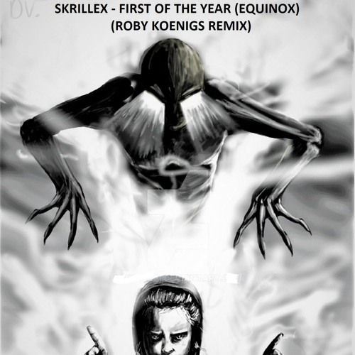
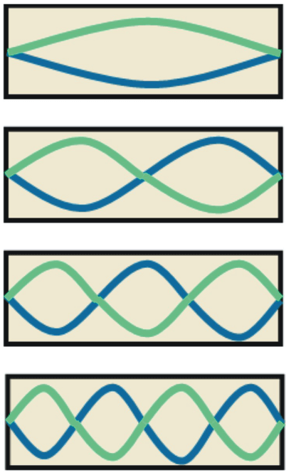
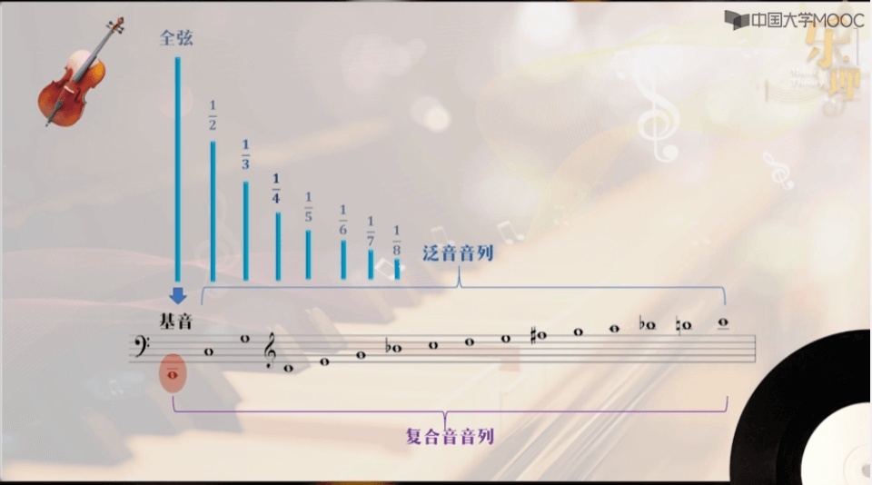
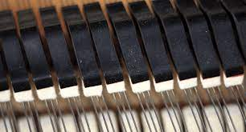
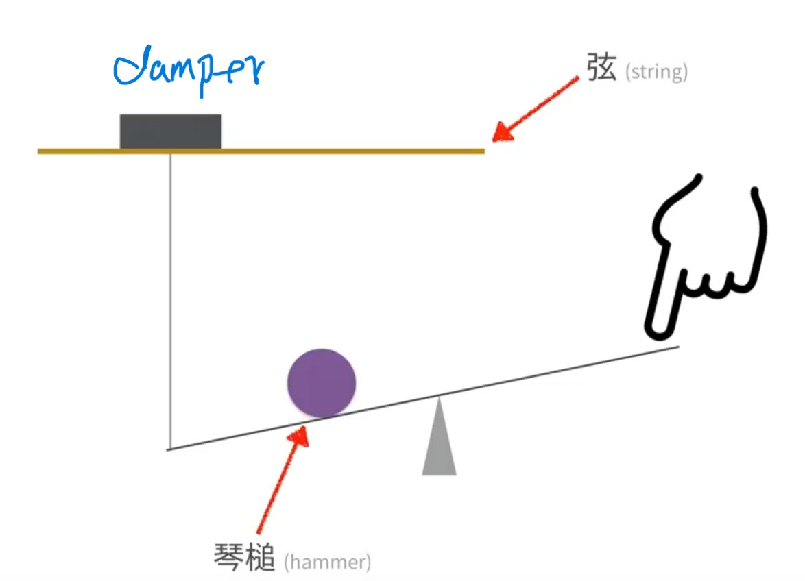
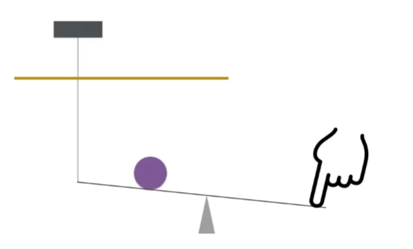

# 一些乐理基础

<h1 align='center'> 前  言</h1>

## 背景

我是一个纯纯的工科生，艺术细胞基本为零，像所有九零后一样，听周杰伦长大的，初中听到音乐频道推荐了一首Maroon5--Daylight，从此开始听欧美音乐
> [网易云链接-dayligh](https://music.163.com/song?id=2029839768&userid=126838601)

高中又不小心听到了一首改变我音乐审美的歌：Skrillex-First Of The Year

> [网易云链接-First Of The Year](https://music.163.com/song?id=1990836&userid=126838601)

我的天啊，原来音乐可以这么做，用这么奇怪的音色，让人情绪十分高涨，后来才知道，这是一首brostep，是<b color='red'>电子音乐</b>的一个类别.

yeah，从此我就对电子音乐产生了浓厚的兴趣，不仅仅是喜欢听，也想自己做。不过我太浮躁了，没有打磨出自己喜欢的作品。

## 理由

我对音乐的感觉其实很少，没什么天赋，唱歌也不好听，甚至有五音不全的可能，所以，做不出好音乐很正常，但是！没有天赋也能学音乐吧，应该，我觉得从零开始学音乐，经过一番搜索，一般音乐学院的培养方案如下：
乐理-->和声-->曲式--->等等等等（目前就了解到这些，够学一阵子了）

足够了，知道方向了，开始学习吧！

写这些文章主要是为了记录自己的过程，记录自己的理解，也希望能给别人一点帮助。

<h1 align='center' style='color:red'> 正  文</h1>

## Preview
今天主要学习了 **音** 这个概念，包括：

- 音的产生
- 乐音和噪音
- **复合音和泛音**
- 音的性质

这里面最难也是最重要的部分就是复合音和泛音，我会重点介绍。

## 音的产生
没什么好讲的，初中物理告诉我们：声音就是物体振动产生的，我们说话就是声带在振动，弹奏钢琴就是琴弦在振动

>声音是振动产生的声波，通过介质（气体、固体、液体）传播并能被人或动物听觉器官所感知的波动现象。
>
>声音的频率一般会以赫兹表示，记为Hz，指每秒钟周期性震动的次数。而分贝是用来表示声音强度的单位，记为dB。
>
>[wiki](https://zh.wikipedia.org/wiki/%E5%A3%B0%E9%9F%B3)

## 乐音和噪音
通俗的来说，乐音就是“好听的”声音，噪音就是“不好听”的声音，钢琴的声音就好听，粉笔刮黑板的声音就不好听。那他们的本质区别是什么呢？

**规律**。没错，就是规律，上面我们说到声音是有频率的，钢琴的声音是“有规律”的 指的就是，钢琴发出来的声音的频率是有规律的

**怎么理解呢？又得从物理角度出发了**
当我们拨动一根弦的时候，它会来回振动是吧，其实如果你观察得够仔细会发现：除了整根弦在振动，它的1/2，1/3...各个小部分也在振动。

我们拍拍脑袋也许就能想到，这一个个小部分的振动和整根弦的振动的`频率`是不同的，而这些频率又遵循着1/2，1/3...这个关系，这就是“有规律”
，这就让钢琴的声音好听了起来。

那这个规律具体是什么呢，就讲到了接下来的内容

<h2 style='color:red'> 复合音与泛音</h2>

所谓复合音，就是`基音`和`泛音`组合起来的音【不权威】，没什么好说的，所以理解基音和泛音是什么就很重要了。

我们来看看泛音(overtone)的解释:

> An <b>overtone</b> is any resonant frequency above the <a href="https://en.wikipedia.org/wiki/Fundamental_frequency" title="Fundamental frequency">fundamental frequency</a> of a sound.  (An overtone may or may not be a harmonic)<a >&#91;1&#93;</a> In other words, overtones are all pitches higher than the lowest pitch within an individual sound; the fundamental is the lowest pitch. While the fundamental is usually heard most prominently, overtones are actually present in any pitch except a true <a href="https://en.wikipedia.org/wiki/Sine_wave" title="Sine wave">sine wave</a>.<a>&#91;2&#93;</a> The relative volume or <a href="https://en.wikipedia.org/wiki/Amplitude" title="Amplitude">amplitude</a> of various overtone partials is one of the key identifying features of timbre, or the individual characteristic of a sound.

> [泛音定义Wiki](https://en.wikipedia.org/wiki/Overtone)

其中比较重要的实事就是：  
1. 泛音比基音高
2. **泛音不一定和谐**
3. 泛音几乎存在于任何音高中，除了单纯的正弦波
4. 泛音相对于基音声音很小

这里有个泛音的实例，来自MOOC廖涵--乐理

**可以得出结论**

- 整根弦振动发出的就是`基音`，其它1/2 到1/n弦振动发出的都是`泛音`，它们都有不同的音高
> 低音区因为弦比较长，所以泛音更多（浑厚），高音区弦比较短，泛音更少（单薄）

- 为什么不和谐：这些泛音的频率存在倍数关系，但是音乐中的音高的设置并不完全遵循这个规律，所以有些泛音就不和谐，例如7、11、13、14倍音

> 具体怎么设置的我也不知道，以后才能学到吧【十二平均律】

下面这个视频演示了这些泛音是否和谐：

老师使用的方法是听两个音是否有`共振`现象。具体方法就是把`制音器`抬起来，按下一个音后，再按它的某一个泛音，听听它们之间是否有共振，有的话就是和谐的。

[【mooc】泛音演示1](https://www.icourse163.org/learn/SCCM-1461521175#/learn/content?type=detail&id=1253462147&cid=1283880701)

**制音器又是什么玩意**
望文生义，制音器其实就是制止发声的一个构造，它通过贴在琴弦上来阻止发声。

我们可以通过这个视频了解了一下钢琴的构造，由Nice Chord录制

<iframe title="鋼琴下面那三個踏板到底是做什麼用的？" width="560" height="315" src="https://wiwi.video/videos/embed/cce20d1d-a509-4074-9c36-92264586182c" frameborder="0" allowfullscreen="" sandbox="allow-same-origin allow-scripts allow-popups"></iframe>

## 课外阅读--钢琴踏板

视频链接：[【nice chord】鋼琴下面那三個踏板到底是做什麼用的？](https://wiwi.video/w/rioC1P2MN7RtgbfU6csBWC?start=44s)

其中比较重要的是：
### 按下琴键发生的事情：  
制音器抬起来，`琴槌`会敲一下弦，弦被敲得振动并发出声音。

如果按住不放，制音器一直会抬着，琴弦就会保持振动（声音越来越小），如果手指放开，制音器就会落下，停止琴弦的振动。

### 延音踏板本质

延音踏板的本质就是把制音器抬起来，让振动继续，从而“延”音
