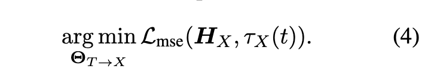
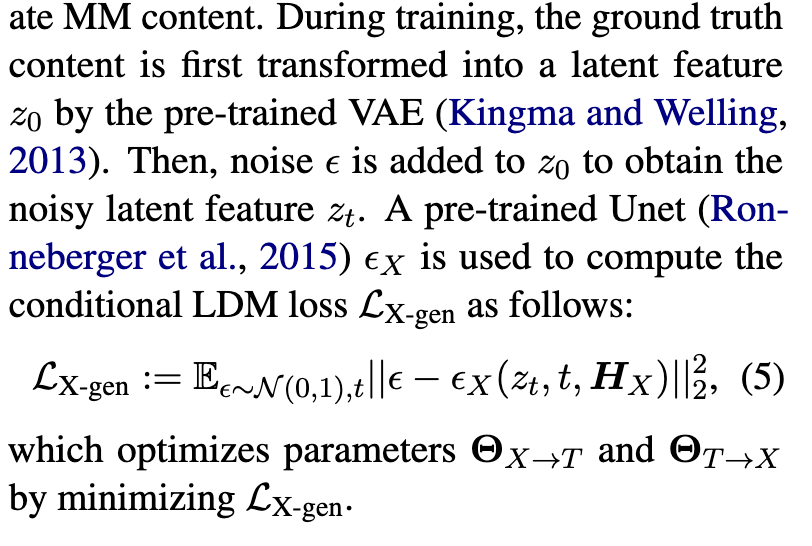
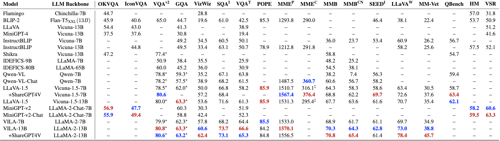

# MM-LLMs:Recent Advances in MultiModal Large Language Models

## 主要工作
1. 一般的模型结构设计和训练pipeline
2. 对126个MM-LLMs进行分类
3. 审查了选定的 MM-LLM 在主流基准上的表现，并总结了增强 MM-LLM 效力的关键训练方法。
4. 维护一个跟踪有前途的方向的网站 [MM-LLMs](https://mm-llms.github.io)
## 背景介绍
多模态的大模型存在计算资源消耗过大的问题，一个合理的解决方法是利用现成的大模型，特别是LLM的推理和决策的能力，来降低计算开销，这催生了一个新的研究领域MM-LLMs 多模态大语言模型

**MM-LLMs的核心挑战是如何有效的将不同模态的模型连接起来以实现协作推理**

主要焦点：通过MM pre-training+MM instruction-tuning pipeline 保持模式（模型）和人类意图的一致性

1.最初研究聚焦在多模态的理解和文本生成

包括 图像文字理解[BLIP-2、LLaVA、MiniGPT-4、OpenFlamingo]，视频文字理解[VideoChat、Video-ChatGPT、LLaMA-VID]，音频文字理解[Qwen-Audio]

2.后来MM-LLM功能得到扩展，支持特定模态的输出

图像文字输出[GILL、Kosmos-2、Emu、MiniGPT-5]，语音文字输出[SpeechGPT、AudioPaLM]

3.最近的研究聚焦在模仿人类的任何模态转换，加速通用人工智能，给LLMs提供外部工具[Visual-ChatGPT、HUggingGPT、AudioGPT]

4.为减少级联系统的传播误差，发展了end-to-end的任意模态MM-LLMs[NExT-GPT、CoDi-2、ModaVerse]

## 模型结构

总的来说，MM-LLMs可以分为两个大的板块，多模态理解以及多模态生成

**多模态理解**主要包含了三个模块

1. 模态编码器，将各种模态的输入$I_X$编码成$F_X$
2. 输入投影器，将$F_X$投影成$P_X$,输入投影仪 的任务是将其他模态 $F_X$ 的编码特征与文本特征空间 $T$对齐
3. LLM 主干网络，将文本输入$F_T$和投影结果输入到LLM中，输出信号$S_X$

**多模态生成**主要包含以下模块

1. 输出投影器
2. 模态生成器

### 模态编码器“Modality Encoder” 
1. 视觉

NFNet-F6、ViT、CLIP ViT、Grounding-DINO- T with Swin-T、DINOv2、SAM-HQ、 RAM++、InternViT、VCoder

2. 音频

C-Former、HuBERT、BEATs、Whisper、CLAP

3. 3D点云

ULIP-2 with a Point-BERT backbone

4. 多种异构多模态，特别是any-to-any

ImageBlind--- 综合了 图像、文字、音频、热力图、“inertial measurement units, and depth” 

### 输入投影器“inpute projector”

输入投影仪 $θX→T$ 的任务是将其他模态 $F_X$ 的编码特征与文本特征空间 $T$ 对齐。


$I_X$ 是多模态输出入、$t$是文本输入，$F_X$是$I_X$编码之后、$P_X$是对$F_X$投影后、$F_T$是文本特征(由$t$得到)

目标是：$\mathcal{L}_{text-gen}$ 最小 时的输入投影input projector

常用模型为：
- Linear Projector
- MLP
- Cross-attention
- Q-Former
- P-Former
- MQ-Former

### LLM主干网络“LLM backbone”

主干网络对投影后的$P_X$和文字特征进行运算，得到文本输出以及信号$S_X$，其中$S_X$是指导生成器生成内容的指令

$P_X$可以看成是对LLM的软微调 soft Prompt-tuning

参数高效的微调(PEFT)，这种方式需要训练的参数更小（少于0.1%）

- prefix-tuning
- lora
- layernorm tuning

chatGPT说：常见的PEFT：**Adapter Layers**、**LoRA**、**Prefix-Tuning**、**Prompt-Tuning**、**BitFit**、**Layer Freezing**

### 输出投影器

它的作用是将LLM输出的$S_X$映射到$MG_X$可以理解的特征$H_X$

给定一个$\\{I_X,t\\}$数据集，$t$首先在LLM中生成$S_X$，然后被output projector映射成$H_X$，

训练的目标就是让$H_X$和$MG_X$的conditional text representation 距离最小

$τX$ 是 $MG_X$ 中的文本条件编码器

### 模态生成器

一般使用现成的 潜在扩散模型（LDMs）stable diffusion、zeroscope、audioLDM-2

HX作用于生成器的去噪过程

VAE:[https://huke88.com/article/8085.html](https://huke88.com/article/8085.html)

VAE理解成滤镜

ground truth content 首先被预训练VAE转换成 $Z_0$  ，然后，将噪声$ε$添加到$z_0$以获得噪声潜在特征$zt$。

优化的目标是 当 误差为正态分布的时候，误差和Unet（潜在特征$zt$，文本$t$，$H_X$）的二次正则最小

## 训练流程
MM-LLM 的训练流程可以分为两个主要阶段：MM PT（多模态预训练）和 MM IT（多模态指令微调）。

**MM PT**

在预训练阶段（通常是利用 XText 数据集），通过优化预定义的目标来训练输入和输出投影器，使其对齐不同的模态。（有时候也会将参数高效型微调（PEFT）技术用于 LLM 骨干。）

在 PT 阶段，通常利用 X-Text 数据集，输入和输出投影仪经过训练，通过优化预定义目标来实现各种模式之间的协调。

对于MM理解模型，优化仅关注方程（2），

而对于MM生成模型，优化涉及方程（2）、（4）和（5）。在后一种情况下，等式（2）还包括真实信号token序列。

**MM IT**

MM IT 是一种需要使用指令格式（instruction-formatted）数据集对预先训练的 MM-LLM 进行微调的方法

通过这个过程，MM-LLM 可以通过遵循新指令泛化到未见过的任务，从而提高零样本性能。

MM IT 包括监督微调（SFT）和人类反馈强化学习（RLHF），旨在与人类意图保持一致并增强 MM-LLM 的交互能力。

SFT 数据集可以构造为单轮 QA 或多轮对话。

RLHF根据MM-LLM的反馈进一步微调

SFT 之后，RLHF 会对模型进行进一步的微调，这需要有关 MM-LLM 所给响应的反馈信息（比如由人类或 AI 标注的自然语言反馈（NLF））。这个过程采用了一种强化学习算法来有效整合不可微分的 NLF。模型的训练目标是根据 NLF 生成对应的响应。

## SOTA模型
Tool-using把LLM当作黑盒子

end to end 表示整个模型以端到端的方式联合训练。
adapter：[https://blog.csdn.net/2301_77818837/article/details/135355919](https://blog.csdn.net/2301_77818837/article/details/135355919)

(1) Flamingo：一系列设计用于处理交织融合的视觉数据和文本的视觉语言（VL）模型，可输出自由形式的文本。

(2) BLIP-2：提出了一种能更高效利用资源的框架，其中使用了轻量级的 Q-Former 来连接不同模态，还使用了冻结的 LLM。使用 LLM，可通过自然语言 prompt 引导 BLIP-2 执行零样本图像到文本生成。

(3) LLaVA：率先将指令微调技术迁移到多模态领域。为了解决数据稀疏性问题，LLaVA 使用 ChatGPT/GPT-4 创建了一个全新的开源多模态指令遵从数据集和一个多模态指令遵从基准 LLaVA-Bench

(4) MiniGPT-4：提出了一种经过精简的方法，其中仅训练一个线性层来对齐预训练视觉编码器与 LLM。这种高效方法展现出的能力能媲美 GPT-4。

(5) mPLUG-Owl：提出了一种全新的用于 MM-LLM 的模块化训练框架，并整合了视觉上下文。为了评估不同模型在多模态任务上的性能，该框架还包含一个指示性的评估数据集 OwlEval。

(6) X-LLM：扩展到了包括音频在内的多个模态，展现出了强大的可扩展性。利用了 QFormer 的语言可迁移能力，X-LLM 成功在汉藏语系汉语语境中得到了应用。

(7) VideoChat：开创了一种高效的以聊天为中心的 MM-LLM 可用于进行视频理解对话。这项研究为该领域的未来研究设定了标准，并为学术界和产业界提供了协议。

(8) InstructBLIP：该模型是基于 BLIP-2 模型训练得到的，在 MM IT 阶段仅更新了 Q-Former。通过引入指令感知型的视觉特征提取和对应的指令，该模型可以提取灵活且多样化的特征。

(9) PandaGPT 是一种开创性的通用模型，有能力理解 6 种不同模态的指令并遵照行事：文本、图像 / 视频、音频、热量、深度和惯性测量单位。

(10) PaLIX：其训练过程使用了混合的视觉语言目标和单模态目标，包括前缀补全和掩码 token 补全。研究表明，这种方法可以有效用于下游任务，并在微调设置中到达了帕累托边界。

(11) Video-LLaMA：提出了一种多分支跨模态预训练框架，让 LLM 可以在与人类对话的同时处理给定视频的视觉和音频内容。该框架对齐了视觉与语言以及音频与语言。

(12) Video-ChatGPT：该模型是专门针对视频对话任务设计的，可以通过整合时空视觉表征来生成有关视频的讨论。

(13) Shikra：提出了一种简单但统一的预训练 MM-LLM，并且专门针对参考对话（Referential Dialogue）任务进行了调整。参考对话任务涉及到讨论图像中的区域和目标。该模型表现出了值得称道的泛化能力，可有效处理未曾见过的情况。

(14) DLP：提出了用于预测理想 prompt 的 P-Former，并在一个单模态语句的数据集上完成了训练。这表明单模态训练可以用于增强多模态学习。

(15) BuboGPT：为了全面理解多模态内容，该模型在构建时学习了一个共享式语义空间。其探索了图像、文本和音频等不同模态之间的细粒度关系。

(16) ChatSpot：提出了一种简单却有效的方法，可为 MM-LLM 精细化调整精确引用指令，从而促进细粒度的交互。通过集成精确引用指令（由图像级和区域级指令构成），多粒度视觉语言任务描述得以增强。

(17) Qwen-VL：一种支持英语和汉语的多语言 MM-LLM。Qwen-VL 还允许在训练阶段输入多张图像，这能提高其理解视觉上下文的能力。

(18) NExT-GPT：这是一种端到端、通用且支持任意模态到任意模态的 MM-LLM，支持自由输入和输出图像、视频、音频和文本。其采用了一种轻量的对齐策略 —— 在编码阶段使用以 LLM 为中心的对齐，在解码阶段使用指令遵从对齐。

(19) MiniGPT-5：这种 MM-LLM 整合了转化成生成式 voken 的技术，并集成了 Stable Diffusion。它擅长执行交织融合了视觉语言输出的多模态生成任务。其在训练阶段加入了无分类器指导，以提升生成质量。

(20) LLaVA-1.5：该模型基于 LLaVA 框架并进行了简单的修改，包括使用一种 MLP 投影，引入针对学术任务调整过的 VQA 数据，以及使用响应格式简单的 prompt。这些调整让模型的多模态理解能力得到了提升。

(21) MiniGPT-v2：这种 MM-LLM 的设计目标是作为多样化视觉语言多任务学习的一个统一接口。为了打造出能熟练处理多种视觉语言任务的单一模型，每个任务的训练和推理阶段都整合了标识符（identifier）。这有助于明确的任务区分，并最终提升学习效率。

(22) CogVLM：一种开源 MM-LLM，其通过一种用在注意力和前馈层中的可训练视觉专家模块搭建了不同模态之间的桥梁。这能让多模态特征深度融合，同时不会损害在下游 NLP 任务上的性能。

(23) DRESS：提出了一种使用自然语言反馈提升与人类偏好的对齐效果的方法。DRESS 扩展了条件式强化学习算法以整合不可微分的自然语言反馈，并以此训练模型根据反馈生成适当的响应。

(24) X-InstructBLIP：提出了一种使用指令感知型表征的跨模态框架，足以扩展用于助力 LLM 处理跨多模态（包括图像 / 视频、音频和 3D）的多样化任务。值得注意的是，它不需要特定模态的预训练就能做到这一点。

(25) CoDi-2：这是一种多模态生成模型，可以出色地执行多模态融合的指令遵从、上下文生成以及多轮对话形式的用户 - 模型交互。它是对 CoDi 的增强，使其可以处理复杂的模态交织的输入和指令，以自回归的方式生成隐含特征。

(26) VILA：该模型在视觉任务上的性能出色，并能在保持纯文本能力的同时表现出卓越的推理能力。VILA 之所以性能优异，是因为其充分利用了 LLM 的学习能力，使用了图像 - 文本对的融合属性并实现了精细的文本数据重新混合。

## 基准和性能


## 未来方向

更通用、更智能的模型

更具挑战性的基准

移动/轻量级部署

具身智能

持续学习

减轻幻觉

偏见和道德考虑

