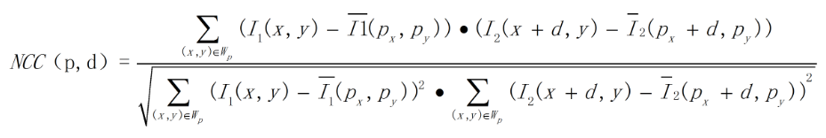
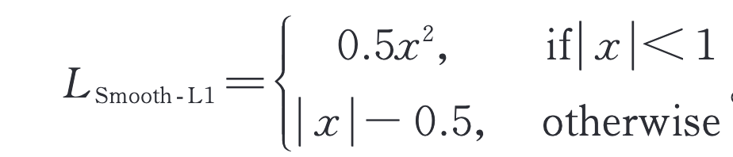

# 双目立体视觉研究进展与应用

## 引言
双目立体视觉利用**立体匹配算法**对校正后的双目相机左右两幅图像进行**密集匹配**,建立两幅图像像素点之间的密集对应关系(用视差图表达),再根据相机参数恢复出场景的深图像。
### 核心
双目视觉的核心在于**立体匹配算法**————即给定左图中的一个像素点 $ (x,y) $ 要确定他在右图中的对应代点 $(x_R,y_R)$, $d=x-x_R(y=y_R)$ ,深度 $Z=BF/d$ 其中$B$为基线长度，$F$为等效焦距。
### 应用
- **三维建模**
- **汽车自动驾驶**
- 机器人自主导航
- 无人机控制
- 火星车定位、月球车定位
- **手机摄影（如背景虚化）**
- 机械手视觉引导
- 摄影测量
- 人流量分析
### 难点
- 降低传感器噪声
- 前后景遮挡
- **弱纹理或重复纹理区域**
- 高反光区域
- 透明物体

### 突破
2020年ECCV最佳论文RAFT引领了基于多次迭代优化的网络结构的发展，一些基于3D卷积网络和transformer的网络结构也有强大的发展潜力.

### 精度评价
立体匹配精度的定量评价指标通常采用端点误差 ($E_{EPE}$)和 误匹配率($R_{PBM}$):
$$
E_{EPE}=\frac{1}{N}\sum_{i=1}^N|d-\hat{d}|,\\\
R_{PBM}=\frac{1}{N}\sum_{i=1}^N|d-\hat{d}|>\delta_d
$$
式中:$N$ 是有效像素的总数;$d$是预测视差;$\hat{d}$ 是真值视 差标签;$δ_d$ 是误匹配的阈值。

在评价时,通常还根据非遮挡区域误匹配率(nonocc)、所有像素点的误匹配率(all)、视差不连续区域误匹配率(disc)等进行评价 。

### 深度学习难点
- 计算资源消耗问题
- 泛化性能问题

## 基本步骤
- 匹配代价计算 

匹配代价计算的目是计算左图中的一个像素点与右图中的某个像素点之间的匹配相似度。
- 代价聚合 

代 价 空 间(cost volume)是 代 价 聚 合 中 的 一 个  重要的概念。3D 的代价空间 C 中的一点 C( x,y,d ) 表  示在像素 ( x,y) 处、视差为 d 时的匹配代价。

代价聚合通常在*代价平面*中进行。最基本的代价聚合方法是盒滤波(box filtering),等价于用一个矩形窗口进行均值滤波,其优点是计算效率高、计算速度与窗口的尺寸无关,缺点是不具备边缘保持特性。

- 视差计算 

代价聚合完成以后,赢家通吃(WTA)是最 基本的视差计算方法。

- 视差优化

用 WTA 得 到 视 差 图 后 ,通 常 还 会 采 用 一 些 视 差 优 化 方 法 进 行 处 理 ,包 括 
- 错 误 匹 配 剔 除 (如 左 右 一 致 性 检 测 、speckle filter 等)、
- 亚 像 素 视 差 值 计 算 、
- 遮 挡 区 域 空 洞 填 充 
- 中 值 滤 波,

从 而 输 出 最 终的视差图。
## 传统立体匹配方法
### 代价计算
- AD/BT
$$
C_{AD}(x,y,d) = |I_L(x,y)-I_R(x-d,y)|
$$
- Census

Census方法任取左图一个像素点P，观察周围3*3窗口的像素点灰度值，如果小于P就置1，否则为0，然后编码。右图也是如此。最后异或比较，根据异或后的结果，看‘1’的个数，计算汉明距离。

- AD+Census
$$
C_{A D}\left(p,d\right)=\frac{\sum_{i=R,G,B}|I_{i}^{left}(p)-I_i^{right}(p-(d,0))|}{3} \\\
C_I(p,d) = 1-exp(-\frac{C_{AD}(p,d)}{\lambda_{AD}})+1-exp(-\frac{C_{census}(p,d)}{\lambda_{sensus}})
$$
- 归一化互相关(NCC)
原理：对于原始的图像内任意一个像素 点(px, py )构建一个n x n的邻域作为匹配窗口。然后对于目标相素位置(px + d, py )同样构建一个n x n大小的匹配窗口，对两个窗口进行相似度度量,注意这里的有一个取值范围。对于两幅图像来说，在进行NCC计算之前要对图像处理，也就是将两帧图像校正到水平位置，即光心处于同一 水平线上，此时极线是水平的,否则匹配过程只能在倾斜的极线方向上完成,这将消耗更多的计算资源。

### 基于全局约束
全 局 最 优 算 法 的 本质是将对应点的匹配问题转化为寻找某一能量函数 的 全 局 最 优 问 题 ,通 常 会 跳 过 代 价 聚 合 步 骤 ,直 接 计 算 视差值。这类算法的核心环节包括能量函数构造和能 量 函 数 的 求 解 策 略，
- 图割法

- 置信度传播
### 基于局部约束
基 于 局 部 约 束 算 法 利 用 兴 趣 点 周 围 的 局 部 信 息 进 行 计 算 ,相 应 的 计 算 复 杂 度较低。基于局部约束的立体匹配方法需要代价聚合 的 步 骤

- 盒滤波 

就是一个窗口进行均值

- 双边滤波

双边滤波器具有良好的边缘保持特性, 匹 配 时 可 以 采 用 一 个 大 的 匹 配 窗 口(比 如 35×35),显 著改善了视差图的边缘准确度。

- 引导滤波器
 
- 十 字 臂 滤 波

- 基 于 最 小 生 成 树 的 代 价 聚 合

- 线 扫 描 代 价 聚 合

**基 于 窗 口 匹 配 方 法 通 常 都 有 一 个 隐 含 的 假 设 ,即 该 窗 口 内 所 有 像 素 点 都 具 有 相 同 的 视 差 值**

## 基于深度学习的立体匹配方法

## 混合方法
- Stereo Matching by Training a Convolutional Neural  Network to Compare Image Patches 

使用CNN计算匹配代价，后续使用传统方法

- Look Wider to Match Image Patches withConvolutional Neural Networks

使用金字塔池化提升效果

将深度学习融入其他模块，效果不好 针对SGM[28]中 惩 罚 参 数 不 易 调 节 的 问 题 ,Seki 等[52]提 出 SGM-Net,

这 些 方 法 相 较 于 传 统 方 法 在 效 果 上 有 着 不 少 的 提 升 但 受 限 于 
- 缺 乏 图 像 全 局 信 息 
- 高 额 的 计 算 负 担 , 

**已经逐渐被端到端的方法所替代**

## **端到端方法**

目的：为 了 提 高 计 算 速 度 、改 善 遮 挡 区 域 和 弱 纹 理 区 域 的 估 计 精 度

端到端的立体匹配网络可以无缝包含立体匹配的全部 步 骤 ,直 接 从 双 目 图 像 中 估 计 出 稠 密 深 度 图 。

### 基于2D卷积
- DispNet --》DispNetS、DispNetC

DispNet[56] 的 结 构 和 端 到 端 光 流 估 计 网 络 FlowNet[61]的结构(图 1)几乎是一样的,甚至比 FlowNet 更 加 简 单 ,因 为 光 流 要 考 虑 两 个 方 向 的 位 移 估 计 ,而 视 差估计只需要考虑水平方向的位置偏移。

DispNetS 把 两 张 三通道的 RGB 图像拼成六通道作为网络的输入,经过 具 有 9 个 卷 积 层 的 收 缩 网 络 后 ,再 进 入 扩 张 网 络 。 在 扩 张 网 络 中 ,通 过 反 卷 积 对 特 征 图 进 行 上 采 样 ,同 时 把 收缩网络同分辨率的特征和上一层网络估计出来的视 差 图 的 上 采 样 拼 接(Concat)起 来 ,再 经 过 逐 层 上 采 样 得到最终的视差图估计。

DispNetC 会对左右图特征图进行相关运 算 ,建 立 一 个 代 价 空 间 。 随 后 将 代 价 空 间 和 左 图 特 征 拼接后,继续用卷积核滤波

**设计残差优化层**
- Learning for disparity estimation through feature constancy
- Cascade residual learning: a two-stage convolutional neural network for stereo matching

**边缘信息**
- EdgeStereo: an effective multi-task learning network for stereo matching and edge detection

**分割信息**
- SegStereo: exploiting semantic information for disparity estimation

**AANet**
将 可 变 形 卷 积[ Deformable convolutional networks]引 入 立 体 匹 配 网 络 ,设 计 两 个 有 效 且 高 效 的 成 本 聚 合 模 块 :自 适 应 同 尺 度 聚 合 模 块(adaptive intra-scale aggregation)和 自 适 应 跨 尺 度 聚 合 模 块  (adaptive cross-scale aggregation)来 实 现 成 本 聚 合 ,从 而 获 得 自 适 应 形 状 的 感 受 野 ,以 完 全 替 代 现 有 SOTA 的立体匹配模型中常用的 3D 卷积,在加快推理速度的 同 时 保 持 较 高 的 准 确 率 。

**HITNet**把 图 像 分 成 一 系 列 的不重叠的图像块(tile),图像块的参数包含 1 个 3 自由 度的几何参数和 1 个可学习的特征向量(可以解释为匹 配 的 质 量)。

**Bi3D**将深度估计问题 转 变 为 分 类 问 题 ,利 用 多 个 分 类 器 对 视 差 进 行 估 计 ,判 断场景内物体的深度值与给定深度距离的远近,从而提 升 网 络 效 率 ,更 契 合 应 用 需 求 。

**SMD-Nets**通 过 紧 凑 参数化的双峰混合密度对视差的前景和背景进行建模, 以解决视差图边缘过于平滑的问题,提升了深度不连续 处的锐利程度。同时,采用连续表达实现了有限的内存 和计算量下的高分辨率输出。

### 基于3D卷积
- **GCNet**


- **PSMNet**
在 刚 发 表 的 时 候 ,占 据 KITTI 排 行 榜 第 一 名 。 特 征 提 取 用 空 间 金 字 塔 池 化(SPP)模 块 ,代 价 空 间 滤 波 采 用 堆 叠 沙 漏(stacked hourglass)结 构 。

**GWCNet**的 代 价 空 间 由 两 部 分 组 成 ,其 中 ,一 部 分 和 PSMNet 类 似(但 通 道 数 更 少),另 外 一 部 分 把 左 右 图 特 征 按 通 道 均 匀 地 划 分 为 若 干 组 ,按 组 进 行 相 关 来 构 建 一 个 代 价 空 间 ,减 少 网 络 参 数 的 同 时 提 高 了 网 络 的 预 测 精 度 。

**StereoNet**是 Google 在 2018 年 设 计 的 一 个 实 时 立 体 匹 配 网 络 ,处 理 速 度 可 以 达 到 60 frame/s。 其加速策略是,在很低的分辨率(如 1/8)计算代价空间 计 算 出 低 分 辨 率 的 视 差 图 ,然 后 对 视 差 图 进 行 2 倍 上 采 样 ,将 上 采 样 的 视 差 图 与 同 分 辨 率 的 左 图 拼 接 后 ,送 入 视 差 优 化 网 络 。 如 此 逐 级 优 化 ,直 至 最 高 分 辨 率 。

Zhang 等**Domain-invariant stereo matching networks**为 了 改 善 立 体 匹 配 网 络 的 泛 化 性 能 ,提 出 域 归 一 化 (domain normalization),其 具 体 做 法 是 先 对 每 张 特 征 图 的 每 个 通 道 进 行 归 一 化(减 去 该 特 征 图 通 道 的 均 值 后 除 以 标 准 差),再 在 通 道 维 度 进 行 一 次 模 归 一 化 。

**BGNet**计了一个高效的基于双边网格学习的代价空间上采样 模 块 ,可 对 现 有 的 立 体 匹 配 网 络( 如 GCNet[70]、 PSMNet[24]、GANet[23]等)加 速 4~29 倍 ,且 保 持 相 当 的 精度。

**A decomposition model for stereo matching**提 出 一 种 高 效 匹 配 高 分 辨 率 图 像 的 方 法 ,先 在 低 分 辨 率 上 进 行 稠 密 匹 配 ,估 计 出 哪 些 区 域 存 在 细 节 损 失 ,然 后 在 高 分 辨 率 上 对 该 区 域 进 行 稀 疏 匹 配 ,从 而 提 高 网 络 效 率 、降 低 显 存 消 耗 , 最终能够对 5000×3500 的图像进行立体匹配。

**CFNet**通 过 融 合 级 联 代 价 空 间 的 方 式 提 升 匹 配 算 法 的 鲁 棒 性 ,并 采 用 基 于 方 差 的 不 确 定 估 计 方 法 ,通 过 估 计 级 联 中 不 同 阶 段 的 不 确 定 度 自 适 应 调 整 下 一 阶 段 的 视 差 搜 索 范 围 ,以 减 少 错 误 匹 配 。

**AcvNet**提 出 一 种 新 的 代 价 空 间 构 建 方 法 ,生 成 注 意 力权重以抑制冗余信息并增强连接体中的匹配相关信 息 ,引 入 多 级 自 适 应 块 匹 配 以 提 升 在 不 同 视 差 甚 至 无 纹 理 区 域 时 的 匹 配 代 价 独 特 性 。

> 基于 3D 卷积的网络结构设计一般遵循经典的立 体 匹 配 步 骤 ,具 有 较 好 的 可 解 释 性 。 相 比 于 三 维 代 价 空 间 ,四 维 代 价 空 间 能 够 提 供 更 多 的 细 节 信 息 ,因 此 所 预测出的视差图精度更高。然而,由于 3D 卷积的高昂 计 算 成 本 ,如 何 设 计 更 高 效 率 的 网 络 架 构 成 为 了 亟 须 解决的问题。  3. 2. 3 基于多
### 基于基于多次迭代优化的网络
**RAFT-Stereo**
- [RAFT-Stereo:Multilevel Recurrent Field Transforms for Stereo Matching](../raft-stereo/)

### 基于 Transformer 的网络
**STTR**,
从 序 列 到 序 列 (seq2seq)的 角 度 去 看 待 深 度 估 计 问 题 。 

STTR 首 先 使 用 卷 积 神 经 网 络 对 双 目 图 像 进 行 特 征 提 取 ,之 后 代 价空间的建立使用 Transformer,包括自注意力机制和 交 叉 注 意 力 模 块 ,分 别 对 相 同 图 像 和 两 张 图 像 的 注 意 力 信 息 进 行 提 取 ,随 着 注 意 力 层 数 的 增 加 ,注 意 力 模 块 会 更 关 注 局 部 语 义 信 息 ,比 如 在 大 范 围 无 纹 理 区 域 中 会 更 倾 向 于 边 缘 等 主 要 特 征 ,这 有 助 于 STTR 解 决 歧 义。

同时,STTR 认为仅仅依靠注意力模块是不够的, 还 使 用 相 对 位 置 编 码 的 方 法 来 提 供 位 置 信 息 ,采 用 最 优 传 输(optimal transport)理 论 和 注 意 力 模 板  (attention mask)的方法对立体匹配进行限制 。

STTR 在 KITTI 等 数 据 集 上 取 得 了 和 基 于 卷 积 的 方 法 相 当 的 结 果 ,甚 至 与 为 高 分 辨 率 图 像 设 计 的 多 分 辨 率 网 络 相比也不逊色,证明了 Transformer 在立体匹配任务中 的可行性。

### 损失函数

$$
L_{\mathrm{disparity}}(d) = {\frac{1}{N}}{\sum_{i=1}^{N}}L(d_{i}-\widehat{d}_{i}),
$$
式中: $N$ 是有效像素的总数; $d$ 是预测视差; $\hat{d}$ 是真值视 差标签; $L$ 可以是 $L1$ 误差:

$$
L_{1}=\mid x\mid,
$$
也可以是Smooth-L1 误差

**Edgestereo** 引入了 边 缘 损 失 函 数，将 边 缘 信 息 和 边 缘 正 则 化 整 合 到 视 差 预 测 网 络 中 ,同 时 估 计 视 差 图 与 边 缘 信 息 ,从 而 提 高 模 型 在 细 节 处 的 预 测效果。

## 自监督与弱监督立体匹配

略

## need to know
- 反卷积
