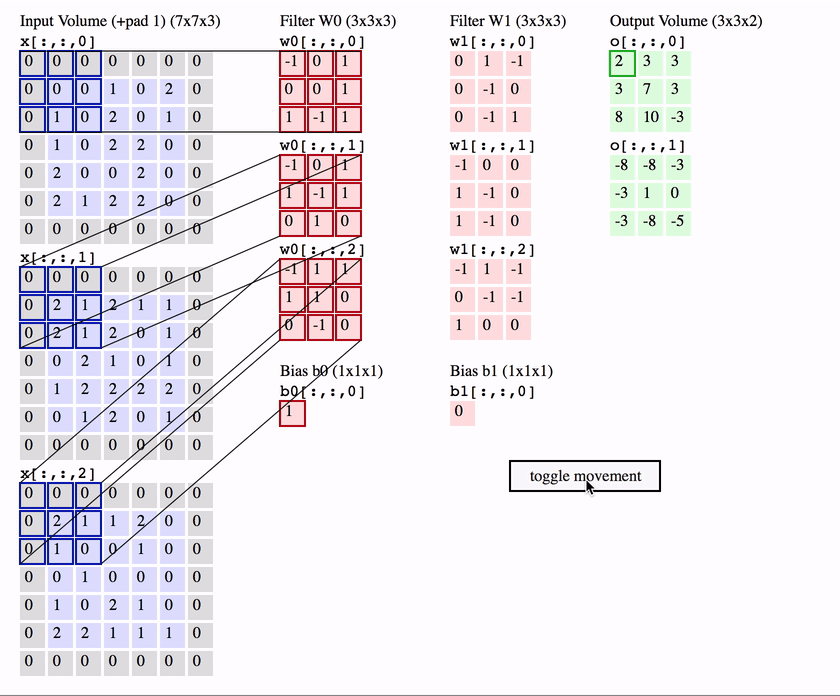

# 第四周


## 学习时间
5月2日 到 6月9日

## 学习目标
- [x] 深度学习计算章节学习
- [x] 卷积神经网络章节学习
- [x] alexnet代码实现
- [x] ResNet论文阅读
## 学习内容
### 深度计算计算
- [模型构建](../../learning/cs/model_construction/)
- [参数管理](../../learning/cs/parameters/)
- [自定义层](../../learning/cs/custom_layer/)
- [文件读写](../../learning/cs/read_write/)
### 卷积神经网络
- [卷积层](../../learning/cs/convolutional_neural_networks/conv_layer/)
- [步幅和填充](../../learning/cs/convolutional_neural_networks/padding-and-strides/)
- [卷积的意义](../../learning/cs/convolutional_neural_networks/why_conv/)
- [多通道](../../learning/cs/convolutional_neural_networks/channels/)
- [池化/汇聚层](../../learning/cs/convolutional_neural_networks/pooling/)
### CNN模型
- [LeNet](../../learning/cs/convolutional_neural_networks/lenet/)
- [VGG](../../learning/cs/convolutional-modern/vgg/)
- [NIN](../../learning/cs/convolutional-modern/nin/)
- [GoogleNet](../../learning/cs/convolutional-modern/googlenet/)
- [Batch Normal](../../learning/cs/convolutional-modern/batch-norm/)
- [\(ResNet\)Deep Residual Learning for Image Recognition\[2015\]](../../learning/paper_review/resnet/)
- [DenseNet](../../learning/cs/convolutional-modern/densenet/)
## 学习总结
本周顺利完成了计划任务，重点在于卷积神经网络的概念和实现，CNN本质上就是一个特征提取的算法
- 从LeNet开始，CNN一直在往更深的网络发展
- VGG构建VGG块包含若干CNN层，然后通过VGG的叠加更轻易地构建深层网络，但是并不能解决全连接层的过拟合和参数过多的问题，
- NiN的主要进步在于去掉了最后的全连接层，而是利用1x1的卷积核在CNN结构中实现类似全连接的效果，最后只用全局的平均pooling作为CNN的输出，
- GoogleNet在类似NiN的前提下，对于Googlenet的块有了更精细的设计，将原始图像通过四条路径进行卷积，
- resnet作为跨时代的成果，巧妙的运用了残差连接提高了更深网络的效果，同时并不会增加网络的参数，
- DenseNet在ResNet的基础上并不是直接将CNN块的输入和输出相加，而是做cat操作，也没有增加更多参数但是提高了模型的表达能力
## 亮点
### torch初始化权重方法
```python
nn.init.normal_(m.weight, mean=0, std=0.01)
nn.init.zeros_(m.bias)
nn.init.constant_(m.weight, 1)
nn.init.xavier_uniform_(m.weight)
```
### 自定义参数
注意使用`nn.Parameters`定义参数，此时可以使用`named_parameters()`查看参数
```python
class ....
    self.weight = nn.Parameters()
    ...
```
### 模型的导出和加载
```python
torch.save(net.state_dict(), 'mlp.params')
clone = MLP()
clone.load_state_dict(torch.load('mlp.params'))
clone.eval() # 评估模式而非训练模式
```
### 卷积层的过程
- 卷积核的层数与输入相同
- 各层卷积之后求和变成一层
- 一个卷积核输出一层
- 卷积核的个数等于输出层数


## 下周计划

- 学习RNN相关章节
- 学习 $\LaTeX$ 的使用
- 了解模型微调/双目视觉的基础理论
