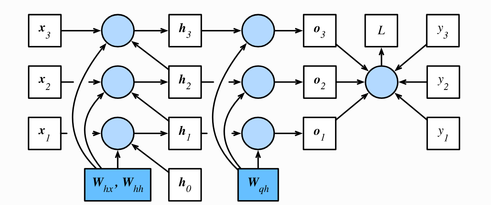

# 第五周

## 学习时间
5月10日 到 6月16日

## 学习目标

- 学习RNN相关章节
    - [x] RNN基础
- [x] 学习 $\LaTeX$ 的使用
- [x] 了解模型微调/双目视觉的基础理论

## 学习内容
### RNN
- [循环神经网络](../../learning/cs/recurrent-neural-networks/sequensce/)
- [RNN手动实现](../../learning/cs/recurrent-neural-networks/rnn-scratch/)
- [RNN简洁实现](../../learning/cs/recurrent-neural-networks/rnn-concise/)

### 双目视觉
- [Computing the Stereo Matching Cost with a Convolutional Neural Network\[2015\]](../../learning/paper_review/computing-the-stereo-matching-cost-with-a-convolutional-neural-network/)

## 学习总结
本周完成效果不是很好，主要原因是RNN的理解相比神经网络和CNN稍难，在公式推导和代码理解上都花了很多时间，另外参加了数学建模比赛，了解相关信息，学习了相关的工具也占用了精力，下周首先要再把本周的内容仔细过一遍，认真写好论文审阅的笔记。  
对于论文审阅效率实在太低，可能是太过于扣细节了，扣到最后发现已经过时而且也有很多知识点扣不懂，也就是说花了大量的时间了解不重要、又难的知识，也许应该调整一下阅读论文的重点和方法。

## 亮点

### RNN图解

从这个图可以很清晰的看出RNN内部到底在做什么事情：

1. 将输入$x_t$和上个状态$h_{t-1}$都使用全连接层，相加得到$h_t$
2. $h_t$ 经过后续神经网络处理作为本次的输出$o_t$
3. 将$h_t$ 传入到 $h_{t+1}$ 中循环1、2步操作

### RNN计算时转置
将输入x 进行onehot之前进行了转置，让X维度代表（时间步数，batch_size, 词典长度）。

关于X的转置，这样的好处我认为在于**减少循环** ：

1. RNN的计算其实是循环的，它需要得到上一时刻的结果才能进行这一时刻的计算，这个循环是避免不了的。
2. 在最外层循环时间步数就是在走这个循环，这样的话第二层的batch_size就不需要循环了
3. 如果最外层是batch_size，那么在第二层依然需要进行时间步数的循环

## 下周计划
- 继续学习RNN相关章节
- 学习 $\LaTeX$ 的使用
- 了解模型微调/双目视觉的基础理论
