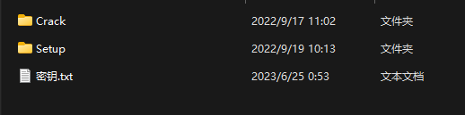
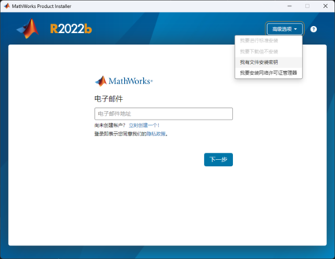
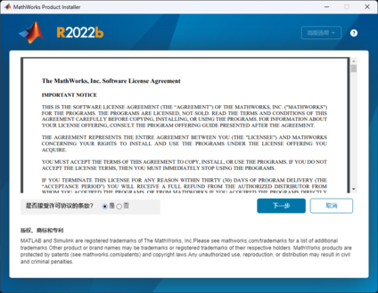
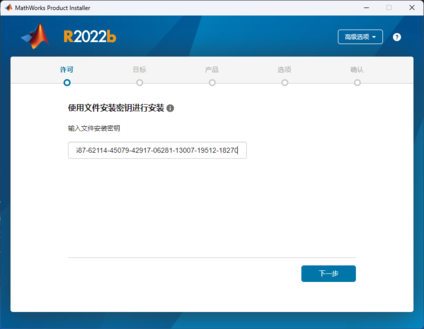
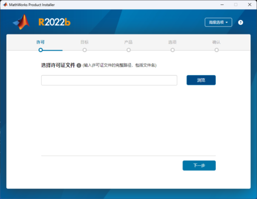
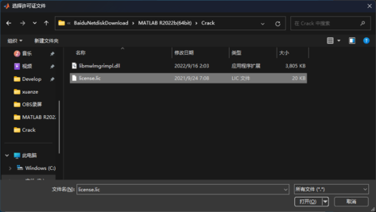
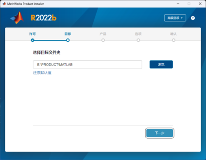

# 软件分享 - matlab2022


辛苦工科人**必备**科研软件。

<!--more-->

本资源收集于互联网，本站不担保完整性和安全性。如有余力，请支持正版软件！


## 软件介绍

> MATLAB（Matrix Laboratory，矩阵实验室）是由美国The MathWorks公司出品的商业数学软件。MATLAB是一种用于算法开发、数据可视化、数据分析以及数值计算的高级技术计算语言和交互式环境。除矩阵运算、绘制函数/数据图像等常用功能外，MATLAB还可用来创建用户界面，以及调用其它语言（包括C、C++、Java、Python、FORTRAN）编写的程序。
## 软件安装

### 1将资源下载并且解压
你会得到如下几个文件：第一个是破解需要的文件，第二个是程序本体，第三个是密钥



> [直达下载链接](#下载链接)

### 2打开`Setup/setup.exe`开始安装

1.注意点击右上角的`【高级选项】`，选择`【我有文件安装密钥】`



2.同意协议后点击`【下一步】`



3.输入`密钥.txt`中的内容到文本框中



**⬇️或者直接在这里复制也可以⬇️**
```python
05322-36228-06991-12654-51812-34369-14072-44298-22786-36732-05503-35033-50900-29808-05166-12170-05630-02560-02687-62114-45079-42917-06281-13007-19512-18270
```
4.点击浏览，找到并选择`Crack/license.lic`





5.后续正常选择安装的包和目录进行安装就可以



## 软件破解
将 `Crack/libmwlmgrimpl.dll`文件拷贝到下面的路径：

```bash
...\MATLAB\bin\win64\matlab_startup_plugins\lmgrimpl\libmwlmgrimpl.dll
```


## 下载链接



链接: https://pan.baidu.com/s/1oRpcUpi0woMZRqG-91gKfg?pwd=pmzz  
提取码: pmzz 


如果觉得对您有帮助，点击下方赞赏帮我买杯咖啡吧！
