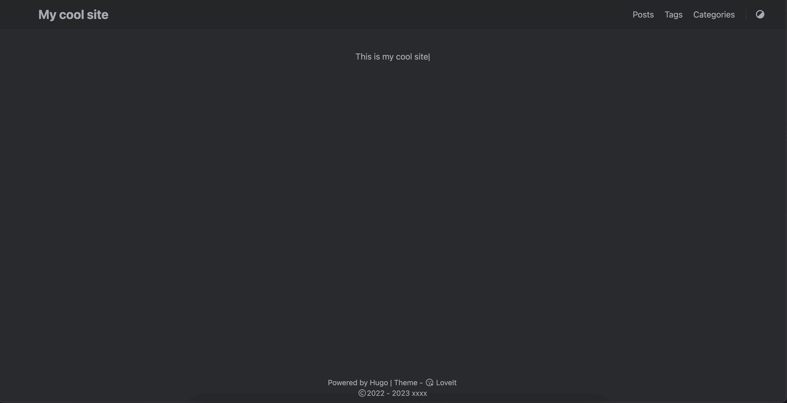

# 【博客搭建1】- 新建网站

利用**HUGO**在本地搭建博客

<!--more-->

## hugo & git 安装
- hugo 基于go语言编写，有编译好的文件，直接安装就可以
- git是开源的版本控制程序
### win
```shell
winget install hugo
winget install git
```

### mac
```bash
brew install hugo
brew install git
```
安装之后执行 `hugo version`查看版本，验证是否成功安装
```bash
(base) ➜  ~ hugo version
hugo v0.93.2+extended darwin/arm64 BuildDate=unknown
```

## 新建网站
### 运行以下代码新建一个hugo站点，并添加主题
```bash
hugo new site yourSiteName
cd yourSiteName
git init
git clone https://github.com/dillonzq/LoveIt.git themes/LoveIt
```

1. 新建hugo站点，这个命令会在当前目录下新建一个文件夹 yourSiteName
2. cd 进入这个文件夹
3. 将这个文件夹初始化为git仓库
4. 复制主题文件到本地，这里选择的是LoveIt这个主题

### 进行基础的配置

编辑 ` config.toml`文件，在你网站的根目录可以找到这个文件，没有就新建一个

以下是loveit提供的基础配置:

```TOML
baseURL = "http://example.org/"

# Change the default theme to be use when building the site with Hugo
theme = "LoveIt"

# website title
title = "My New Hugo Site"

# language code ["en", "zh-CN", "fr", "pl", ...]
languageCode = "en"
# language name ["English", "简体中文", "Français", "Polski", ...]
languageName = "English"

# Author config
[author]
  name = "xxxx"
  email = ""
  link = ""

# Menu config
[menu]
  [[menu.main]]
    weight = 1
    identifier = "posts"
    # you can add extra information before the name (HTML format is supported), such as icons
    pre = ""
    # you can add extra information after the name (HTML format is supported), such as icons
    post = ""
    name = "Posts"
    url = "/posts/"
    # title will be shown when you hover on this menu link
    title = ""
  [[menu.main]]
    weight = 2
    identifier = "tags"
    pre = ""
    post = ""
    name = "Tags"
    url = "/tags/"
    title = ""
  [[menu.main]]
    weight = 3
    identifier = "categories"
    pre = ""
    post = ""
    name = "Categories"
    url = "/categories/"
    title = ""

# Markup related configuration in Hugo
[markup]
  # Syntax Highlighting (https://gohugo.io/content-management/syntax-highlighting)
  [markup.highlight]
    # false is a necessary configuration (https://github.com/dillonzq/LoveIt/issues/158)
    noClasses = false

```
### 启动服务

```bash
hugo serve
```
启动之后会输出这一段话，代表着已经成功启动了
```bash
Web Server is available at http://localhost:1313/ (bind address 127.0.0.1)
Press Ctrl+C to stop
```
现在访问`http://localhost:1313/`就能看到你的网站啦


