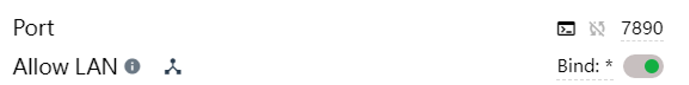

# 使用WSL进行pytohn开发


众所周知，windows的shell非常不好用，很多linux好用的命令都不能用，
在学术领域，绝大多数的实验都是在linux环境跑的，也就是说很多脚本是需要linux的shell进行运行，配置一个WSL环境能够基本无痛地使用linux shell。

WSL可以理解为一个运行在windows下的子系统，我们可以使用windows方便的桌面系统来访问linux的终端。关于WSl的详细介绍可以参考官方文档，

本文主要分享我的WSL+Unbuntu+vscode的环境配置方法，并解决了WSL的代理问题，使其能使用宿主机的代理设置。

## Unbuntu安装
我的系统是win11，所以自带了WSl，WSL的安装请参考官方文档。
使用如下命令查看支持的子系统
```bash
wsl --list --online
```
这里推荐使用Unbuntu-20.04,公认更加稳定

```bash
wsl --install -d Ubuntu-20.04 
```
## 设置默认子系统

### 查看所有子系统
```bash
wslconfig /l

适用于 Linux 的 Windows 子系统分发:
Ubuntu-20.04 (默认)
docker-desktop
```
### 设置默认

```bash
wslconfig /s Ubuntu-20.04
```
至此，在windows shell中 运行`wsl`即可进入Unbuntu

## 使用vscode
在wsl环境中，直接运行
```bash
code .
```
该命令会在windows中打开vscode 并且连接到WSl。

## 使用主机代理

WSL默认是没走代理的，这对于中国用户很不友好，这里提供一种使用宿主机代理的方法。

### 宿主设置
打开代理软件的LAN/局域网模式，并记住port,我这里是7890.



### Unbuntu设置

在家目录中创建一个脚本 `.proxy.sh`
```bash
vim .proxy.sh
```
内容如下：

```bash
#!/bin/sh

hostip=$(ip route |grep default|awk '{print $3}')
wslip=$(hostname -I | awk '{print $1}')
port=7890
export https_proxy=http://${hostip}:${port} http_proxy=http://${hostip}:${port} all_proxy=socks5://${hostip}:${port}
```
然后在 `.bashrc`中添加alias

```bash
alias proxy='source /home/pmzz/.proxy.sh'
alias noproxy='unset https_proxy; unset http_proxy; unset all_proxy; unset ALL_PROXY;'
```
注意这里的`pmzz`替换成自己的用户名。

然后运行：
```bash
source .bashrc
```
这个时候就可以使用`proxy`来开启代理，使用`noproxy`来关闭代理
