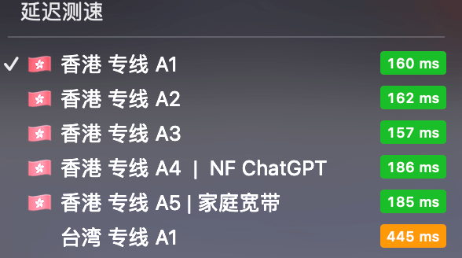
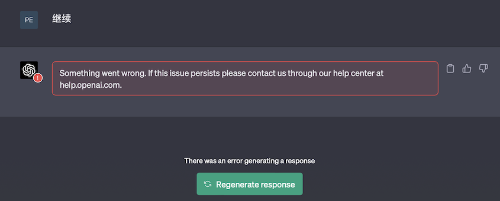
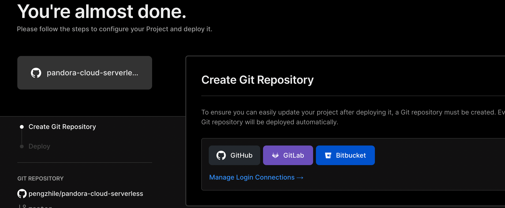

# 搭建自己的GPT服务，提高访问速度

## 问题
chatGPT就不介绍了，所有人都明白它的厉害之处，但是对于国人来说，访问它是十分困难的，就算你历经千辛万苦终于注册到了账号，使用了科学上网，也还是很有可能遇到以下问题


被屏蔽，这是最令人头疼的事情，需要你的飞机场提供可用的服务器，而且他的服务器还有随时被封ip的风险



基本只能通过刷新和等待解决，这样会影响你上下文，可能需要重新提问


## 材料
感谢[pengzhile](https://github.com/pengzhile)大佬提供的方案：[pandora-潘多拉，一个让你呼吸顺畅的ChatGPT](https://github.com/pengzhile/pandora)

你也可以直接访问大佬的网站，免费提供服务【需要自己有账号】


[免费服务](https://chat.zhile.io/)


如果你想搭建自己的服务不给大佬占用带宽，可以准备以下材料自己搭建一个服务
1. chatGPT账号
2. github账号

是的你需要先自行解决账号问题

## 步骤

1. 点击这个按钮就可以了

它会导航到vercel网站并从大佬的仓库中copy将代码copy到你的仓库并启动服务

2. 点击github按钮并输入你的仓库名称
例如我的是： pmzzgpt

## 效果

