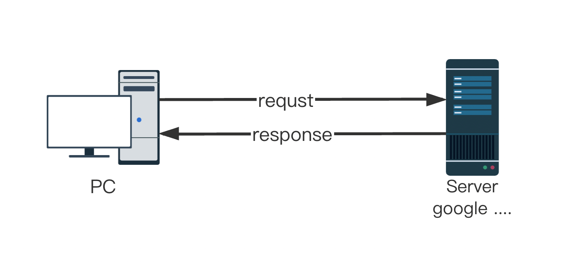
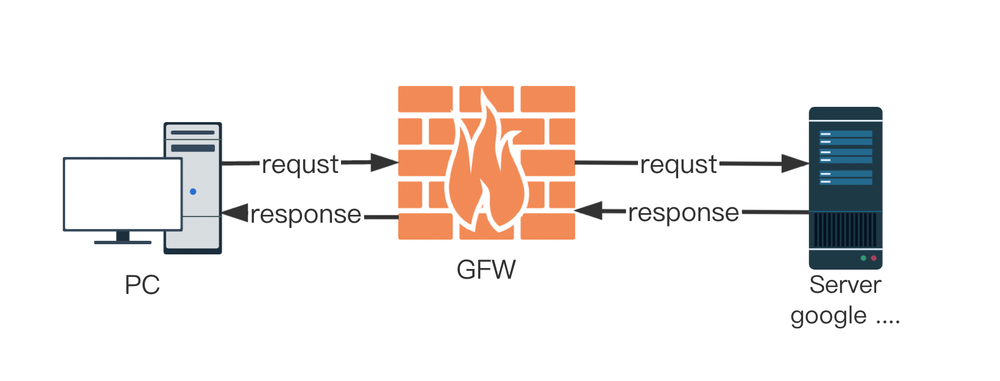
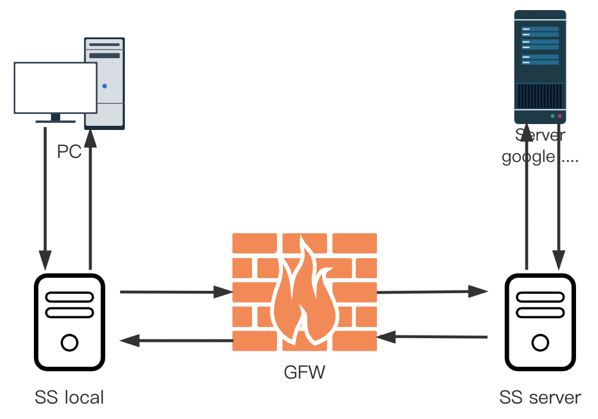
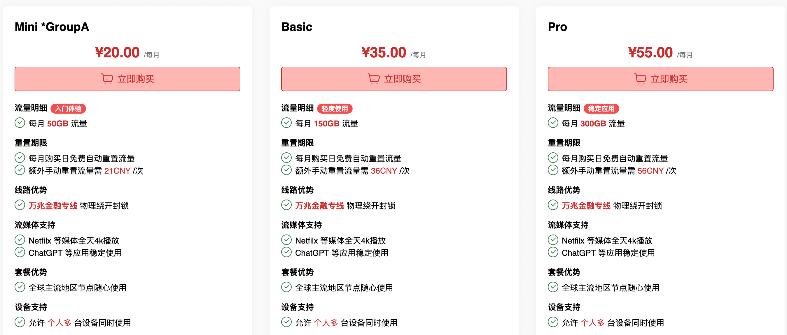

# 魔法上网机场推荐

**打开**互联网世界的大门
<!--more-->

## 什么是科学上网
很久很久以前，我们与互联网的沟通是完全没有障碍的

然后`GFW`出现了，防火长城（英语：Great Firewall，常用简称：GFW），中文也称中国国家防火墙，通常简称为墙、防火墙等，中国国家互联网信息办公室称为数据跨境安全网关 ，是中华人民共和国政府监控和过滤国际互联网出口内容的软硬件系统集合，用于通过技术手段，阻断不符合中国政府要求的互联网内容传输。
现在我们访问互联网的方式是这样：

伟大的长城会把<b>“不适合中国宝宝体质”</b>的内容拦截下来，以保护中国宝宝的安全

**科学上网**就是要绕过这一堵墙，获得互联网上的内容

## 如何科学上网
聪明的人们想到了利用境外服务器代理的方法来绕过 GFW 的过滤，其中包含了各种HTTP代理服务、Socks服务、VPN服务… 

### shadowsocks
[@clowwindy](https://github.com/shadowsocks/shadowsocks)开源了大名顶顶的shadowsocks（后被请喝茶，删除了源码）

它的工作原理是：通过墙两边的服务器对你的网络请求进行加密，迷惑GFW，让它不知道你访问的是什么东西，她会觉得，万一你的请求价值一百个亿呢，也就不会把你的请求挡住。

虽然shadowsocks被请喝茶了，但是在之前已经有很多分支（go，C语言之类的）在被维护，所以它依然是目前最流行的科学上网方式。
### 机场

shadowsocks相关的标志一般是一个小飞机，所以提供科学上网服务的网站一般被大家叫做机场。

## 机场推荐
我自己用过很多机场，目前在用的是[Duangcloud](https://portal.dc-site5.com/#/register?code=6kvhwJBB),用了快一年了，感觉还可以。



:(fas fa-hand-point-right): [Duangcloud](https://portal.dc-site5.com/#/register?code=6kvhwJBB) :(fas fa-hand-point-left):



**优点：**

- 支持chatGPT
- 网络稳定，速度快
- 有客服群，随时联系
- 价格合适，节日有打折优惠

我打折买了Basic的年付，其实轻度使用**Mini**就够了。

如果觉得对您有帮助，点击下方赞赏帮我买杯咖啡吧！
